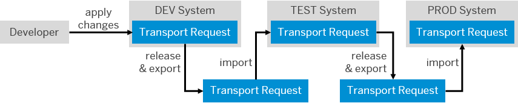
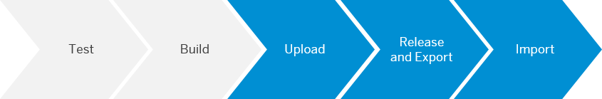

<!-- loio3713b07025274c2fbc95467627921a7a -->

# Apply CI/CD to SAP Fiori Development on an SAP Fiori Front-End Server

Implement a CI/CD pipeline for the development of SAPUI5/SAP Fiori applications on an SAP Fiori front-end server.

> ### Tip:  
> If you use Jenkins or plan to use it, have a look at [**project "Piper"**](https://sap.github.io/jenkins-library/), instead.

For a full overview of the different solutions SAP provides for CI/CD, see [SAP Solutions for Continuous Integration and Delivery](https://help.sap.com/viewer/8cacec64ed854b2a88e9a0973e0f97a2/Cloud/en-US/e9fa320181124fa9808d4446a1bf69dd.html).

<a name="loio3713b07025274c2fbc95467627921a7a__section_ody_tc1_sjb"/>

## Context

The most common ABAP system setup is a staging landscape that consists of three different systems: One for development \(DEV\), one for acceptance testing \(TEST\), and a productive one \(PROD\). In this order, they are linked to each other through transport routes. Following these routes, transport requests are exported from one system and imported into the next. The following graphic illustrates this procedure:

  
  
**Transport Requests in a Typical ABAP System Setup**

Your staging landscape must at least consist of two different systems: DEV and PROD. Depending on your needs, however, you can combine as many systems as you like.

> ### Note:  
> The following procedure describes the transport from one system to another. Depending on how many systems you use, repeat parts of it as often as necessary. For more information, see section **The Transport Management System**.

When combining continuous integration with the ABAP life-cycle management, the CI process ensures the quality of the code implemented outside the ABAP system. Through minification and the generation of a preload, it converts the sources into the correct format, runs automated tests and code checks, and produces an artifact that is ready to be uploaded to the ABAP development system. From there, the ABAP system takes over and transports the changes to the test system, and finally to the productive one.

Therefore, the described workflow consists of two distinct parts:

> ### Tip:  
> Expand the following sections for more detailed information.

### The Continuous Integration Process

The CI process outside the ABAP system contains the following steps:

In detail, this process works as follows:

1.  In a source code management tool of your choice, apply changes to your SAPUI5/SAP Fiori project.

2.  Merge your changes with the master branch. Thereby, the CI process is triggered.

3.  The CI process runs. It includes the following tasks:

    -   Static code checks for JavaScript

    -   Automated tests

    -   Minification, which means that all comments and white spaces are removed from the JavaScrip sources to reduce the load on the network

    -   Generating a preload, which means that all JavaScript files are merged into a single file to reduce the number of requests from the browser to the server

    -   Packaging the application into a ZIP file

    The last three tasks of the CI process constitute the **Build** step.

### The Transport Management System

The mainly automated delivery process with the Transport Management System contains the following steps:

In detail, this process works as follows:

1.  Immediately after a successful CI build, the build scheduler is triggered. It performs the following tasks:

    -   Creating a new, individual transport request in the ABAP development system

    -   Uploading the application to the ABAP development system

    -   Releasing the transport request

2.  Manually import the transport request into the following ABAP system.

> ### Note:  
> If in your ABAP system setup, you use more than two different systems, repeat the **Release and Export** and **Import** steps as often as necessary.

<a name="loio3713b07025274c2fbc95467627921a7a__section_w51_rbp_sjb"/>

## OData vs. RFC

To orchestrate the Transport Management System, your CI/CD pipeline directly communicates with the ABAP development system. Depending on which version of SAP NetWeaver you use, choose between the following protocols:

-   **Open Data Protocol \(OData\)**

    OData is a REST-based web protocol for querying and updating data as well as for applying and building on web technologies. It is used by SAP Gateway and recommended for SAP NetWeaver systems **\>= 7.5 SPS12**. For more information, see [SAP Gateway, REST and OData](https://help.sap.com/viewer/68bf513362174d54b58cddec28794093/201809.002/en-US/ecaeea50ca692309e10000000a445394.html).

-   **Remote Function Call \(RFC\)**

    RFC calls a function to be executed in a remote system and is the standard SAP interface for communication between SAP NetWeaver systems. For more information, see [RFC](https://help.sap.com/viewer/753088fc00704d0a80e7fbd6803c8adb/7.4.22/en-US/4888068ad9134076e10000000a42189d.html).

> ### Note:  
> Although you can use RFC for all SAP NetWeaver systems, we recommend OData for newer ones \(\>= 7.5 SPS12\).

Depending on which protocol you use, choose one of the following procedures:

-   **[Apply CI/CD to SAP Fiori Development on an SAP Fiori Front-End Server with OData](apply-ci-cd-to-sap-fiori-development-on-an-sap-fiori-front-end-server-with-odata-82d852a.md)**

-   **[Apply CI/CD to SAP Fiori Development on an SAP Fiori Front-End Server with RFC](apply-ci-cd-to-sap-fiori-development-on-an-sap-fiori-front-end-server-with-rfc-3eb8d58.md)**

For an overview of all procedures in this guide, see [Procedures for CI/CD Pipelines](procedures-for-ci-cd-pipelines-e49a97d.md).

