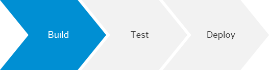
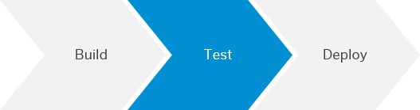
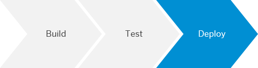

<!-- loio1fd3a82e80b34a8a807c880850d64e11 -->

# Apply CI/CD to SAP Fiori Development on SAP BTP

Implement a CI/CD pipeline for the development of SAPUI5/SAP Fiori applications on SAP BTP in the Neo environment.

> ### Tip:  
> If you use Jenkins or plan to use it, have a look at the [**project "Piper"**](https://www.project-piper.io) scenario [Build and Deploy SAPUI5/SAP Fiori Applications on SAP BTP](https://www.project-piper.io/scenarios/ui5-sap-cp/Readme/), instead.

For a full overview of the different solutions SAP provides for CI/CD, see [SAP Solutions for Continuous Integration and Delivery](https://help.sap.com/viewer/8cacec64ed854b2a88e9a0973e0f97a2/Cloud/en-US/e9fa320181124fa9808d4446a1bf69dd.html).


<a name="loio1fd3a82e80b34a8a807c880850d64e11__section_mgd_jjh_h3b"/>

## Context

This procedure explains how to wrap your SAPUI5/SAP Fiori application into a multitarget application \(MTA\) to produce an archive that is deployable on SAP BTP. As of today, many CI tools provide Bash scripting support and you can implement the corresponding Bash commands in a CI tool of your choice.

A multitarget application \(MTA\) is a package that comprises multiple application and resource modules, which share a common lifecycle even though they might have been created with different technologies and deployed to different runtimes. To create a MTA, you bundle the modules, describe them along with their interdependencies to other modules, services, and interfaces, and package them. MTAs can be deployed to SAP HANA Extended Application Services, Advanced Model, Cloud Foundry, and Neo environments. In this procedure, you deploy the resulting .mtar file to the SAP BTP Neo environment. For more information, see [The Multitarget Application Model](https://www.sap.com/documents/2016/06/e2f618e4-757c-0010-82c7-eda71af511fa.html).


<a name="loio1fd3a82e80b34a8a807c880850d64e11__section_hwh_tc5_b3b"/>

## Prerequisites

-   As it prevents clutter on your build system and improves both maintainability and flexibility, we recommend working with [Docker](https://www.docker.com/). Refer to the documentation of your CI tool to check whether it supports the usage of Docker containers in its pipelines.

    > ### Caution:  
    > Please check with your IT and security departments how to handle Docker images from public sources.

-   You have an SAPUI5/SAP Fiori application as source in a source code management system of your choice. To build it, you can choose between two different tooling options:

    -   [UI5 Tooling](https://sap.github.io/ui5-tooling/pages/CLI/#build)

    -   Grunt


    > ### Note:  
    > If you generate your project in SAP Web IDE, depending on its version, the builder is preconfigured to either Grunt or UI5 tooling.

    Depending on your tooling, expand one of the following sections and make sure that you meet the described prerequisites:


### Additional Prerequisites When Using the UI5 Tooling

On the top level of your directory, you have:

-   An mta.yaml which contains the following script:

    > ### Sample Code:  
    > ```
    > ID: openui5-sample-app
    > version: 1.0.0
    > _schema-version: '2.1'
    > modules:
    >   - name: webapp
    >     type: html5
    >     path: .
    >     parameters:
    >       disk-quota: 256M
    >       memory: 256M
    >     build-parameters:
    >       builder: npm
    > ```

-   A package.json file which contains the following build script:

    ```
    "scripts": {
      "build": "ui5 build --a",
      "test": "uiveri5"
      "linting": "eslint ."
    }
    ```

    > ### Note:  
    > The build script executes the UI5 command-line tool. In this example, the test script runs UIVeri5. You can, however, substitute `uiveri5` with any other automated tests you have implemented.


### Additional Prerequisites When Using Grunt

On the top level of your directory, you have:

-   A mta.yaml file which contains the following script:

    > ### Sample Code:  
    > ```
    > ID: openui5-sample-app
    > version: 1.0.0
    > _schema-version: '2.1'
    > modules:
    >   - name: webapp
    >     type: html5
    >     path: .
    >     parameters:
    >       disk-quota: 256M
    >       memory: 256M
    >     build-parameters:
    >       builder: npm
    > ```

-   A package.json file which contains the following build script:

    ```
    "scripts": {
      "build": "ui5 build --a",
      "test": "uiveri5"
      "linting": "eslint ."
    }
    ```

    > ### Note:  
    > The build script executes the UI5 command-line tool. In this example, the test script runs UIVeri5. You can, however, substitute `uiveri5` with any other automated tests you have implemented.

-   A local .npmrc file that contains the following entry to download the `@sap/grunt-sapui5-bestpractice-build`:

    ```
    registry=https://registry.npmjs.org/
    @sap:registry=https://npm.sap.com/
    ```

    > ### Note:  
    > If you use our recommended Docker image, this reference already exists.

-   A Grunt file which contains the following:

    ```
    module.exports = function (grunt) {
                "use strict";
                grunt.loadNpmTasks("@sap/grunt-sapui5-bestpractice-build");
                grunt.config.merge({ compatVersion: "1.38" });
                grunt.registerTask("default", [
                            "clean",
                            "lint",
                            "build"
                ]);
                grunt.loadNpmTasks("@sap/grunt-sapui5-bestpractice-test");
                grunt.registerTask("unit_and_integration_tests", ["test"]);
                grunt.config.merge({
                            coverage_threshold: {
                                        statements: 0,
                                        branches: 100,
                                        functions: 0,
                                        lines: 0
                            }
                });
    };
    ```

    For more information on how to set up your Grunt build in SAP Web IDE Full-Stack, see [Grunt Build in SAP Web IDE Full-Stack](https://developers.sap.com/tutorials/webide-grunt-basic.html).


<a name="loio1fd3a82e80b34a8a807c880850d64e11__section_ovd_wc5_b3b"/>

## Procedure

In this procedure, we focus on the core stages of a pipeline: build, test, and deploy.

> ### Tip:  
> You can combine and enhance these simple build, test, and deploy steps to implement more complex pipelines.

1.  **Build**

    

    The build optimizes and packages your project sources. Use the Cloud MTA Build Tool to orchestrate the technical build steps using Node Package Manager \(npm\), which are defined in the package.json. See [Cloud MTA Build Tool](https://hub.docker.com/r/devxci/mbtci). Depending on your configuration, you can also add linting and unit tests. The build produces an out.mtar file, which is used in the following deployment stage. See step 3: **Deploy**.

    For more information on how to download, set up, and run the Cloud MTA Build Tool, see  <?sap-ot O2O class="- topic/xref " href="25d8fa1893e24d76860ed3ac0674dd52.xml" text="" desc="" xtrc="xref:9" xtrf="file:/home/builder/src/dita-all/jtx1624028100992/loio5b9abaab0f4a4a33afffca604543625a_en-US/src/content/localization/en-us/1fd3a82e80b34a8a807c880850d64e11.xml" output-class="" outputTopicFile="file:/home/builder/tp.net.sf.dita-ot/2.3/plugins/com.elovirta.dita.markdown_1.3.0/xsl/dita2markdownImpl.xsl" ?>  [Setting Up and Using the Multitarget Application Archive Builder](https://help.sap.com/viewer/58746c584026430a890170ac4d87d03b/Cloud/en-US/9f778dba93934a80a51166da3ec64a05.html).

    To run the build, choose one of the following options:

    -   **With Docker:**

        Execute the following command in the directory that contains your project sources:

        ```
        docker run -v "${PWD}":/project devxci/mbtci:latest mbt --mtar out.mtar --platform CF build
        ```

        > ### Note:  
        > As many CI tools automatically mount your workspace that contains the project sources into your Docker container, you may omit the `-v` command, which mounts your current working directory.

        > ### Tip:  
        > If you change the build target to `CF` or `XSA`, you can reuse this call for other scenarios.

    -   **Without Docker:**

        If you provide all dependencies on the build server, you can build your project without Docker by placing the multitarget application archive builder directly on your build system. See [https://tools.hana.ondemand.com/\#cloud](https://tools.hana.ondemand.com/#cloud).

        Execute the following command in the directory that contains your project sources:

        ```
        java -jar /path/to/mta.jar --mtar out.mtar --build-target NEO build
        
        ```


2.  **Test**

    

    Depending on your requirements and the setup of your project, consider adding automated tests to it. In your package.json, you have already configured them with the following lines:

    ```
      "test": "uiveri5"
      "linting": "eslint ."
    ```

    For SAPUI5/ SAP Fiori, we recommend implementing UIVeri5 and OPA5 tests. See, for example [Add Automated System Tests with the SAPUI5 Test Recorder to Your CI/CD Pipeline](https://developers.sap.com/tutorials/cp-cicd-systemtest-recorder.html) and [Testing](https://sapui5.hana.ondemand.com/#/topic/7cdee404cac441888539ed7bfe076e57.html).

    To add automated tests, choose one of the following options:

    -   **With Docker:**

        From the Docker community, use a standard image using Node.js in a version that fits your requirements and execute the following commands.

        ```
        docker run -v "${PWD}":/project node:latest npm run-script test
        ```

        ```
        docker run -v "${PWD}":/project node:latest npm run-script linting
        ```

        > ### Note:  
        > As many CI tools automatically mount your workspace that contains the project sources into your Docker container, you may omit the `-v` command, which mounts your current working directory.

    -   **Without Docker:**

        In your shell, execute the following commands:

        ```
        npm run-script test
        ```

        ```
        npm run-script linting
        ```


3.  **Deploy**

    

    Depending on whether you work or do not work with Docker, use one of the following commands to deploy your application to the Neo environment. In a shell environment, provide the required variables: SAP BTP host, account, and user credentials. Please refer to the documentation of your specific CI tool for how to store variables.

    To upload the resulting out.mtar file from the build step to SAP BTP, use the `deploy-mta` command of the Console Client for the Neo environment, which you can download from [https://tools.hana.ondemand.com/\#cloud](https://tools.hana.ondemand.com/#cloud) and which is part of any SAP BTP SDK for the Neo environment. For more information, see [Console Client for the Neo Environment](https://help.sap.com/viewer/65de2977205c403bbc107264b8eccf4b/Cloud/en-US/76132306711e1014839a8273b0e91070.html).

    > ### Caution:  
    > Don't put credentials in the call but use the credential mechanism of your CI tool, instead.

    -   **With Docker:**

        Adapt the following command by replacing the placeholders in brackets with your actual values and execute it.

        ```
        docker run -v "${PWD}":/project ppiper/neo-cli:latest neo.sh deploy-mta --host ${HOST} --account ${ACCOUNT} --source out.mtar --synchronous --user ${USER} --password ${PASS}
        ```

        > ### Note:  
        > As many CI tools automatically mount your workspace that contains the project sources into your Docker container, you may omit the `-v` command, which mounts your current working directory.

    -   **Without Docker:**

        Place the SDK for the Neo environment of your choice on the build machine and call it.

        ```
        /path/to/cloud-platform-sdk/tools/neo.sh deploy-mta --host ${HOST} --account ${ACCOUNT} --source out.mtar --synchronous --user ${USER} --password ${PASS}
        ```


    For more options, see [Console Client Commands](https://help.sap.com/viewer/65de2977205c403bbc107264b8eccf4b/Cloud/en-US/56e309f496cc446ba441d862db94cb18.html).


<a name="loio1fd3a82e80b34a8a807c880850d64e11__section_jz3_b5j_t3b"/>

## Result

You have built a basic CI/CD pipeline, which you can enhance according to your needs, for example, by adding additional tests and manual release steps.

> ### Note:  
> This guide also provides other procedures to enhance your finished CI/CD pipelines. See [Procedures for CI/CD Pipelines](procedures-for-ci-cd-pipelines-e49a97d.md).

