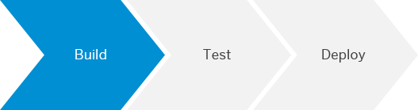
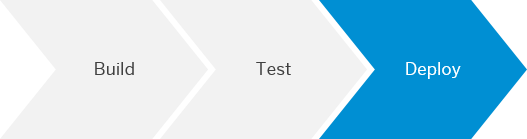

<!-- loio55242ddaa08d4f3190fd06171b5f85f5 -->

# Apply CI/CD to SAP HANA Extended Application Services, Advanced Model Development

Implement a CI/CD pipeline for the development of SAP HANA extended application services, advanced model applications.

> ### Tip:  
> If you use Jenkins or plan to use it, have a look at [**project "Piper"**](https://sap.github.io/jenkins-library/), instead.

For a full overview of the different solutions SAP provides for CI/CD, see [SAP Solutions for Continuous Integration and Delivery](https://help.sap.com/viewer/8cacec64ed854b2a88e9a0973e0f97a2/Cloud/en-US/e9fa320181124fa9808d4446a1bf69dd.html).


<a name="loio55242ddaa08d4f3190fd06171b5f85f5__section_n2j_bz2_kkb"/>

## Context

This procedure implements a CI/CD process for a multitarget application that runs on an SAP HANA extended application services, advanced model server.

An SAP HANA extended application services, advanced model application can consist of a couple of modules \(for both UI and backend\). To bundle and deploy these modules, the multitarget application archive format is used. A multitarget application \(MTA\) is a package that comprises multiple application and resource modules, which share a common lifecycle even though they might have been created with different technologies and deployed to different runtimes. To create an MTA, you bundle the modules, describe them along with their interdependencies to other modules, services, and interfaces, and package them. For more information, see [The Multitarget Application Model](https://www.sap.com/documents/2016/06/e2f618e4-757c-0010-82c7-eda71af511fa.html).

A CI/CD pipeline for SAP HANA extended application services, advanced model comprises the following steps:

1.  Push your code changes to a source code management \(SCM\) tool of your choice. The push event to the SCM system triggers the CI process.

2.  In the CI build, the Cloud MTA Build Tool \(MBT\) triggers the technology-specific compilers for the respective modules contained in the MTA. For more information, see [Cloud MTA Build Tool](https://sap.github.io/cloud-mta-build-tool/).

3.  The Cloud MTA Build Tool packages the artifacts from each module into one archive file with the extension `.mtar`.

4.  The build result is automatically deployed into an environment for automated testing during the CI build. The CI build may contain different tests, such as static code checks for the JavaScript sources \(ESLint\) and automated user interface tests \(for example, [Add Automated System Tests with the SAPUI5 Test Recorder to Your CI/CD Pipeline](https://developers.sap.com/tutorials/cp-cicd-systemtest-recorder.html)\).

5.  The MTA archive is deployed to the production environment.


The following graphic illustrates this procedure:

  
  
**CI/CD in SAP HANA Extended Application Services, Advanced Model Development**


<a name="loio55242ddaa08d4f3190fd06171b5f85f5__section_pxc_v2k_kkb"/>

## Prerequisites

-   As it prevents clutter on your build system and improves both maintainability and flexibility, we recommend working with [Docker](https://www.docker.com/). Refer to the documentation of your CI tool to check whether it supports the usage of Docker containers in its pipelines.

    > ### Caution:  
    > Please check with your IT and security departments how to handle Docker images from public sources.

-   If you don't want to work with Docker, make sure that you have installed the [XS Advanced Command-Line Client](https://help.sap.com/viewer/400066065a1b46cf91df0ab436404ddc/2.0.04/en-US/1307bc5dbb844146b0cf4594b39fc3db.html).


In your MTA, you can have various modules. Depending on which module type you intend to use in them, choose from the following sets of additional prerequisites:

> ### Tip:  
> Expand the section that fits your scenario.


### SAP Fiori

-   You have an SAPUI5/SAP Fiori application as module in the sources of your MTA application. For building it, use the [UI5 Tooling](https://sap.github.io/ui5-tooling/pages/CLI/#build).

-   On the top level of your directory, you have a file named `mta.yaml`, which contains the following entry in the modules section:

    ```
    modules:
      - name: webapp
        type: html5
        path: .
        parameters:
          disk-quota: 256M
          memory: 256M
        build-parameters:
          builder: npm
    ```

-   On the top level of your directory, you have a file named `package.json`, which contains the following build script:

    ```
    "scripts": {
      "build": "ui5 build --a",
      "test": "uiveri5"
      "linting": "eslint ."
    }
    ```

    > ### Note:  
    > The build script executes the UI5 command-line tool. In this example, the test script runs UIVeri5. You can, however, substitute `uiveri5` with any other automated tests you have implemented.


### Java

-   You have a Java application as module in the sources of your MTA application.

-   On the top level of your directory, you have a file named `mta.yaml` which contains the following:

    > ### Sample Code:  
    > ```
    > modules:
    >   - name: webapp
    >     type: java
    >     path: .
    >     parameters:
    >       disk-quota: 256M
    >       memory: 1024M
    >     build-parameters:
    >       build-result: 'target/*.jar'
    >       builder: mvn
    > ```

-   On the top level of your Java project, you have a pom.xml, which controls the Maven build.


<a name="loio55242ddaa08d4f3190fd06171b5f85f5__section_pcs_fgl_mkb"/>

## Procedure

In this procedure, we focus on the core stages of a CI/CD pipeline: build, test, and deploy.

> ### Tip:  
> You can combine and extend these simple build, test, and deploy steps to implement more complex pipelines.

1.  **Build**

    

    The build optimizes and packages your project sources. Use the Cloud MTA Build Tool \(MBT\) to orchestrate the technical build steps using either npm or Maven. Depending on your configuration, you can also add linting and unit tests. The build produces an out.mtar file, which is used in the following deployment stage. See step 3: **Deploy**.

    For more information on how to download, set up, and run the Cloud MTA Build Tool, see [Cloud MTA Build Tool](https://sap.github.io/cloud-mta-build-tool/).

    To run the build, choose one of the following options:

    -   **With Docker:**

        Execute the following command in the directory that contains your project sources:

        ```
        docker run -v "${PWD}":/project devxci/mbtci:latest mbt build -p xsa
        
        ```

        > ### Note:  
        > As many CI tools automatically mount your workspace that contains the project sources into your Docker container, you may omit the `-v` command, which mounts your current working directory.

    -   **Without Docker:**

        If you provide all dependencies on the build server, you can build your project without Docker by placing the Cloud MTA Build Tool directly on your build system. See [Cloud MTA Build Tool](https://sap.github.io/cloud-mta-build-tool/).

        Execute the following command in the directory that contains your project sources:

        ```
        mbt build -p xsa
        
        ```


2.  **Test**

    

    Depending on your requirements and the setup of your project, consider adding automated tests to it. For SAPUI5/ SAP Fiori, we recommend implementing UIVeri5 and OPA5 tests. See, for example, [Add Automated System Tests with the SAPUI5 Test Recorder to Your CI/CD Pipeline](https://developers.sap.com/tutorials/cp-cicd-systemtest-recorder.html).

    To add automated tests, choose one of the following options:

    -   **With Docker:**

        Use a Docker image that fits your requirements, for example, [node](https://hub.docker.com/_/node) for NodeJS.

        ```
        docker run -v "${PWD}":/project node:latest <execute your build script>
        ```

        > ### Note:  
        > As many CI tools automatically mount your workspace that contains the project sources into your Docker container, you may omit the `-v` command, which mounts your current working directory.

    -   **Without Docker:**

        In your shell, execute your test script.


3.  **Deploy**

    

    Depending on whether you work or do not work with Docker, use one of the following commands to deploy your application to SAP HANA.

    > ### Caution:  
    > Don't write credentials into a file but use the credential mechanism of your CI tool, instead.

    -   **With Docker:**

        If you want to use our XS command-line Dockerfile, you have to build it locally, first. See [XS Command-Line Client Dockerfile](https://github.com/SAP/devops-docker-xs-cli).

        Adapt the following command with your actual values and execute it:

        ```
        docker run -v "${PWD}":/home ppiper/xs-cli:latest xs api <YOUR SAP HANA ENDPOINT> && xs login -u <USERNAME> -p <PASSWORD> && xs push
        ```

    -   **Without Docker:**

        Adapt the following commands and in this order, execute them:

        -   ```
xs api <YOUR SAP HANA ENDPOINT>
```

        -   ```
xs login -u <USERNAME> -p <PASSWORD>
```

        -   ```
xs bg-deploy
```


<a name="loio55242ddaa08d4f3190fd06171b5f85f5__section_jz3_b5j_t3b"/>

## Result

You have created a basic CI/CD pipeline, which you can extend according to your needs, for example, by adding additional tests and manual release steps.

> ### Note:  
> This guide also provides procedures to enhance your finished CI/CD pipelines. See [Procedures for CI/CD Pipelines](procedures-for-ci-cd-pipelines-e49a97d.md).

