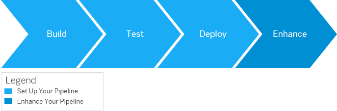

<!-- loio1ae37c7c7ad343589e2bd2fd424c9105 -->

# Continuous Integration and Delivery Best Practices Guide

Implement continuous integration for SAP-specific development projects.

<a name="loio1ae37c7c7ad343589e2bd2fd424c9105__section_cj2_dnh_h3b"/>

## What Is This Guide About?

The Continuous Integration and Delivery Best Practices Guide provides simple procedures to implement continuous delivery \(CD\) pipelines on any CI/CD stack. It does not describe fully fledged pipelines, but rather demonstrates how to apply the principles of CI/CD to SAP-specific technologies. For more information about the concepts and principles of CI/CD, have a look at the [Continuous Integration and Delivery Introduction Guide](https://help.sap.com/viewer/ee5a61247061455ab232c19179fe4c3b/Cloud/en-US).

In this guide, each procedure describes one specific SAP scenario and either focuses on the core stages of a pipeline \(build, test, and deploy\) or helps you enhance your existing pipeline with SAP BTP services. See [Procedures for CI/CD Pipelines](procedures-for-ci-cd-pipelines-e49a97d.md).

  
  
**Set Up Your Pipeline vs. Enhance Your Pipeline**

As they are supported by most CI tools, the Continuous Integration and Delivery Best Practices Guide proposes implementations using Bash.

<a name="loio1ae37c7c7ad343589e2bd2fd424c9105__section_rks_4yh_h3b"/>

## Is This Guide for You?

The Continuous Integration and Delivery Best Practices Guide addresses **customers who want to use their existing CI infrastructure** \(exept for Jenkins, see the following tip\) and **experts in CI/CD who want to have full flexibility when implementing their pipelines**.

> ### Tip:  
> If you use Jenkins or plan to use it, consider working with [project "Piper"](https://sap.github.io/jenkins-library/), instead.

For a full overview of the different solutions SAP provides for CI/CD, see [SAP Solutions for Continuous Integration and Delivery](https://help.sap.com/viewer/8cacec64ed854b2a88e9a0973e0f97a2/Cloud/en-US/e9fa320181124fa9808d4446a1bf69dd.html).

<a name="loio1ae37c7c7ad343589e2bd2fd424c9105__section_ygt_jvz_k3b"/>

## What You Should Consider Before Getting Started

To keep the setup of your CI environment and the installation of tools used in your pipelines as simple as possible, in our procedures, we use [Docker](https://www.docker.com/) containers whenever applicable. However, in our scripting examples, we also provide alternatives without using Docker.

For more information on using Docker and its advantages, see [SAP Solutions for Continuous Integration and Delivery](https://blogs.sap.com/2019/03/28/containerization-a-game-changer-for-devops-and-cicd/).

> ### Caution:  
> Please check with your IT and security departments how to handle Docker images from public sources.

