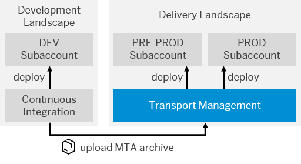
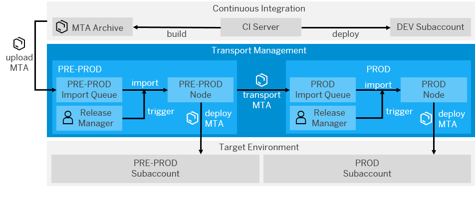

<!-- loio6b27ecd7ecbf46a7bfea5e940f4d6412 -->

# Integrate SAP Cloud Transport Management into Your CI/CD Pipeline

Add an enterprise-ready change and release management process to your CI/CD pipeline and enable the transport of cloud-based applications on SAP BTP between several stages.

> ### Tip:  
> If you use Jenkins or plan to use it, have a look at the [**project "Piper"**](https://www.project-piper.io) scenario [Integrate SAP Cloud Transport Management Into Your CI/CD Pipeline](https://www.project-piper.io/scenarios/TMS_Extension/), instead.

For a full overview of the different solutions SAP provides for CI/CD, see [SAP Solutions for Continuous Integration and Delivery](https://help.sap.com/viewer/8cacec64ed854b2a88e9a0973e0f97a2/Cloud/en-US/e9fa320181124fa9808d4446a1bf69dd.html).


<a name="loio6b27ecd7ecbf46a7bfea5e940f4d6412__section_ang_dbt_53b"/>

## Context

This procedure explains how to upload a [multitartget application](https://www.sap.com/documents/2016/06/e2f618e4-757c-0010-82c7-eda71af511fa.html) out of a CI/CD pipeline to SAP Cloud Transport Management and then import it into its target environment.

SAP Cloud Transport Management allows you to manage the transport of development artifacts and application-specific content between different SAP BTP accounts. It adds transparency to the audit trail of changes so that you get information about who performed which changes in your production accounts and when they did it. At the same time, the Transport Management service enables a separation of concerns: For example, a developer of an application or SAP BTP content artifacts can trigger the propagation of changes, while the resulting transport is handled by a central operations team. For more information, see [SAP Cloud Transport Management](https://help.sap.com/viewer/product/TRANSPORT_MANAGEMENT_SERVICE/Cloud/en-US).

The following graphic provides an overview about the interplay between continuous integration and SAP Cloud Transport Management:

  
  
**Interplay of Continuous Integration and SAP Cloud Transport Management**




<a name="loio6b27ecd7ecbf46a7bfea5e940f4d6412__section_sct_yjt_53b"/>

## Prerequisites

-   You have an existing CI pipeline, which you want to enhance with SAP Cloud Transport Management.

-   You have an MTA project and the folder structure of its sources corresponds to the standard MTA structure. For more information, see [The Multitarget Application Model](https://www.sap.com/documents/2016/06/e2f618e4-757c-0010-82c7-eda71af511fa.html).

-   You have access to SAP Cloud Transport Management. See [Provide Access to SAP Cloud Transport Management](https://help.sap.com/viewer/7f7160ec0d8546c6b3eab72fb5ad6fd8/Cloud/en-US/13894bed9e2d4b25aa34d03d002707f9.html).

-   You have set up SAP Cloud Transport Management and created a service key. See [Set Up the Environment to Transport Content Archives directly in an Application](https://help.sap.com/viewer/7f7160ec0d8546c6b3eab72fb5ad6fd8/Cloud/en-US/8d9490792ed14f1bbf8a6ac08a6bca64.html).

-   You have configured your Transport Management landscape. See [Configuring the Landscape](https://help.sap.com/viewer/7f7160ec0d8546c6b3eab72fb5ad6fd8/Cloud/en-US/3e7b04236d804a4eb80e42c6360209f1.html).


<a name="loio6b27ecd7ecbf46a7bfea5e940f4d6412__section_vqv_yjt_53b"/>

## Procedure

This procedure belongs to the **Enhance Your Pipeline** category, which means that you can use it to enhance any CI process that meets the prerequisites, for example, the one described in [Apply CI/CD to SAP Fiori Development on SAP BTP](apply-ci-cd-to-sap-fiori-development-on-sap-btp-1fd3a82.md#loio1fd3a82e80b34a8a807c880850d64e11).

The following graphic shows an example of the detailed procedure when combining continuous integration and SAP Cloud Transport Management:

  
  
**Detailed Procedure When Combining CI and SAP Cloud Transport Management**



The process flow contains the following steps:

1.  The CI server builds a multitarget application \(MTA\) archive.

2.  The MTA is uploaded into the import queue of the target node, which is specified in the CI pipeline \(in this example, PRE-PROD\).

3.  The release manager manually triggers or schedules the import, which results in the physical deployment of the MTA archive into the corresponding subaccount \(in this example, PRE-PROD\).

4.  As soon as the import is executed, a transport is triggered along the defined transport route so that the MTA archive reaches the import queue of the next node \(in this example, PROD\).

5.  There, the physical import into the corresponding subaccount can be either triggered manually by the release manager or automatically by using the scheduling mechanisms of SAP Cloud Transport Management.


To enhance your exisiting CI/CD pipeline with SAP Cloud Transport Management, execute the following tasks:

1.  **Upload**

    

    1.  Copy the SAP Cloud Transport Management service key and store it in the secret store of your CI server.

    2.  To authenticate yourself against Transport Management, adapt and use this API call:

        **API Call for Authenticating against Transport Management**


        <table>
        <tr>
        <td valign="top">
        
        **HTTP Method** 
        
        </td>
        <td valign="top">
        
        `POST` 
        
        </td>
        </tr>
        <tr>
        <td valign="top">
        
        **URL** 
        
        </td>
        <td valign="top">
        
        ```
        https://<serviceKey.uaa.url>/oauth/token/?grant_type=client_credentials&response_type=token
        ```

        Use a JSON parser to extract the value `uaa.url` from the service key.
        
        </td>
        </tr>
        <tr>
        <td valign="top">
        
        **Headers** 
        
        </td>
        <td valign="top">
        
        -   **Key**: `Username`

            **Value**: `<serviceKey.uaa.clientid>`

        -   **Key**: `Password`

            **Value**: `<serviceKey.uaa.clientsecret>`


        Use a JSON parser to extract the values `uaa.clientid` and `uaa.clientsecret` from the service key.
        
        </td>
        </tr>
        <tr>
        <td valign="top">
        
        **Response** 
        
        </td>
        <td valign="top">
        
        You get an **access token**, which is needed for following Transport Management API calls.
        
        </td>
        </tr>
        </table>
        
    3.  To upload your MTA to SAP Cloud Transport Management, adapt and use this API call:

        **API Call for Uploading an MTA to Transport Management**


        <table>
        <tr>
        <td valign="top">
        
        **HTTP Method** 
        
        </td>
        <td valign="top">
        
        `POST` 
        
        </td>
        </tr>
        <tr>
        <td valign="top">
        
        **URL** 
        
        </td>
        <td valign="top">
        
        ```
        https://<serviceKey.uri>/v2/files/upload
        ```

        Use a JSON parser to extract the value `uri` from the service key.
        
        </td>
        </tr>
        <tr>
        <td valign="top">
        
        **Header** 
        
        </td>
        <td valign="top">
        
        **Key**: `Authorization`

        **Value**: `bearer <access_token>`
        
        </td>
        </tr>
        <tr>
        <td valign="top">
        
        **Body** 
        
        </td>
        <td valign="top">
        
        -   **Key**: `File`

            **Value**: `<file with application content>`

        -   **Key**: `namedUser`

            **Value**: `<id of the user performing the request>`


        
        </td>
        </tr>
        <tr>
        <td valign="top">
        
        **Response** 
        
        </td>
        <td valign="top">
        
        You get a **file ID**, which is needed for further Transport Management API calls.
        
        </td>
        </tr>
        </table>
        
    4.  To upload the MTA archive to a transport node, adapt and use this API call:

        **API Call for Uploading an MTA Archive to a Transport Node**


        <table>
        <tr>
        <td valign="top">
        
        **HTTP Method** 
        
        </td>
        <td valign="top">
        
        `POST` 
        
        </td>
        </tr>
        <tr>
        <td valign="top">
        
        **URL** 
        
        </td>
        <td valign="top">
        
        ```
        https://<serviceKey.uri>/v2/nodes/upload
        ```


        
        </td>
        </tr>
        <tr>
        <td valign="top">
        
        **Header** 
        
        </td>
        <td valign="top">
        
        **Key**: Authorization

        **Value**: `bearer <access_token>`
        
        </td>
        </tr>
        <tr>
        <td valign="top">
        
        **Body** 
        
        </td>
        <td valign="top">
        
        > ### Sample Code:  
        > ```
        > {
        >   "nodeName": "PRE-PROD",
        >   "contentType": "MTA",
        >   "description": "<your description>",
        >   "storageType": "FILE",
        >   "namedUser": "<id of the user performing the request>",
        >   "entries": [
        >     {
        >   	 "uri": "<fileId>"
        >     }
        >   ]
        > }
        > ```


        
        </td>
        </tr>
        </table>
        

2.  **Import**

    

    After successfully uploading your MTA archive to SAP Cloud Transport Management, you can use the import mechanism of Transport Management to distribute it within your transport landscape. See [Using the Import Queue](https://help.sap.com/viewer/7f7160ec0d8546c6b3eab72fb5ad6fd8/Cloud/en-US/3c4b6f38866b4a70b20e79501db5f7e5.html).

    Choose between the following options:

    -   To manually import your artifacts, see [Import Transport Requests](https://help.sap.com/viewer/7f7160ec0d8546c6b3eab72fb5ad6fd8/Cloud/en-US/d2005d5d2fc346b98eff7146107243fc.html).

    -   To schedule automated imports, see [Schedule Imports](https://help.sap.com/viewer/7f7160ec0d8546c6b3eab72fb5ad6fd8/Cloud/en-US/110a7a4d19a34a6cb9a5422c5c9eb35b.html).


<a name="loio6b27ecd7ecbf46a7bfea5e940f4d6412__section_qdt_1kt_53b"/>

## Result

You have enhanced your CI/CD pipeline with SAP Cloud Transport Management.

> ### Note:  
> Now, you can also add change request management with SAP Soluiton Manager to your pipeline. See [Integrate Change Request Management with SAP Solution Manager into Your CI/CD Pipeline](integrate-change-request-management-with-sap-solution-manager-into-your-ci-cd-pipeline-c13a897.md).

For an overview of all procedures in this guide, see [Procedures for CI/CD Pipelines](procedures-for-ci-cd-pipelines-e49a97d.md).

