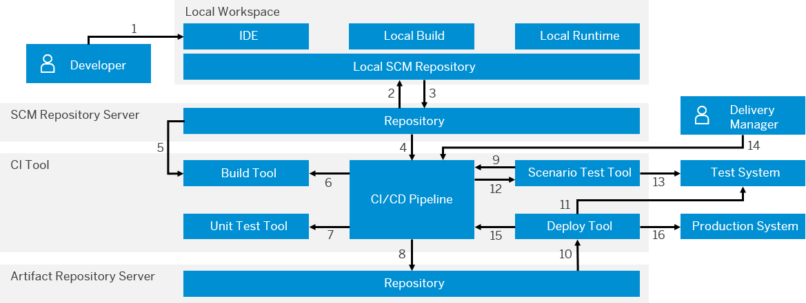

<!-- loioe4976f4a16474fe0b1d57e9280ecc38d -->

# Actors in a CI/CD Process Flow

Get an overview of the actors involved in a basic CI/CD process flow and their interplay.

> ### Note:  
> This is a high-level overview of a basic CI/CD process flow. Depending on their specific requirements, actual implementations may differ in both their components and layout.

<a name="loioe4976f4a16474fe0b1d57e9280ecc38d__section_xkr_jrk_rhb"/>

## Main Actors Involved

The following main actors are part of a basic CI/CD process flow:

**Main Actors Involved in a CI/CD Process Flow**

<table>
<tr>
<th valign="top">

Actor

</th>
<th valign="top" colspan="2">

Description

</th>
</tr>
<tr>
<td valign="top">

The **developer** 

</td>
<td valign="top" colspan="2">

The developer creates changes in his or her local workspace, which comprises either a physically installed or a cloud IDE \(integrated development environment\) and a local SCM \(source code management system\) repository.

</td>
</tr>
<tr>
<td valign="top">

The **CI/CD infrastructure** 

</td>
<td valign="top" colspan="2">

The CI/CD infrastructure consists of:

-   the central instance of the **source code management system**
-   a **CI tool**, which controls the CI pipeline, provides transparency, and manages build and test requests
-   the **build tooling on build nodes**
-   the **test tooling on test nodes** for automated tests that do not require a runtime system
-   an **artifact repository**, which stores the build results
-   a **deployment tool** for installing the application to runtime systems
-   **test runtime systems** onto which the application is deployed for acceptance tests

</td>
</tr>
<tr>
<td valign="top">

The **quality manager** 

</td>
<td valign="top">

The quality manager executes acceptance tests and triggers the deployment to the test system.

</td>
<td valign="top" rowspan="2">

> ### Note:  
> Both the **quality manager** and the **delivery manager** roles can be automated so that the deployment works without human approval. In this case, the whole process is referred to as **continuous deployment**.

</td>
</tr>
<tr>
<td valign="top">

The **delivery manager** 

</td>
<td valign="top">

The delivery manager releases the application and triggers its deployment to production.

</td>
</tr>
<tr>
<td valign="top">

The **productive runtime system** 

</td>
<td valign="top" colspan="2">

The productive runtime system is the final destination to which a change can be deployed after having successfully passed all relevant tests.

</td>
</tr>
</table>

<a name="loioe4976f4a16474fe0b1d57e9280ecc38d__section_gw3_5tk_rhb"/>

## Interplay Between All Actors Involved

The following figure demonstrates the interplay between the single actors in the CI/CD process flow.

> ### Tip:  
> In the following figure, hover over each number for a description of the action performed.

### Legend:

<table>
<tr>
<td valign="top">

**1**   create change

</td>
<td valign="top">

**5**   clone sources to                         

</td>
<td valign="top">

**9**   trigger test deployment               

</td>
<td valign="top">

**13**   test

</td>
</tr>
<tr>
<td valign="top">

**2**   fetch latest version of the main line

</td>
<td valign="top">

**6**   trigger build

</td>
<td valign="top">

**10**   fetch artifact

</td>
<td valign="top">

**14**   release

</td>
</tr>
<tr>
<td valign="top">

**3**   push change

</td>
<td valign="top">

**7**   trigger unit tests

</td>
<td valign="top">

**11**   deploy to test

</td>
<td valign="top">

**15**   trigger production deployment

</td>
</tr>
<tr>
<td valign="top">

**4**   trigger event

</td>
<td valign="top">

**8**   upload artifacts

</td>
<td valign="top">

**12**   trigger test

</td>
<td valign="top">

**16**   deploy to production

</td>
</tr>
</table>

For more detailed information about the CI/CD process flows, see [Continuous Integration and Delivery Process Flows](continuous-integration-and-delivery-process-flows-436c92c.md#loio436c92cdb53c40f788e6d60fd8dc9615).

