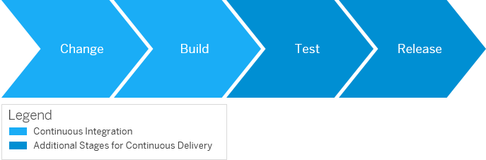

<!-- loio7fc38a80cda446ef856c01f748dbede8 -->

# Continuous Integration and Delivery Introduction Guide

Get to know continuous integration and continuous delivery and plan your own CI/CD process setup.

<a name="loio7fc38a80cda446ef856c01f748dbede8__section_cj2_dnh_h3b"/>

## What Is This Guide About?

The Continuous Integration and Delivery Introduction Guide provides you with basic knowledge for setting up and implementing continuous integration \(CI\) and continuous delivery \(CD\) processes. It gives an overview of the concepts and principles of CI/CD, explains both procedures and the relation between them, and helps you plan your own CI/CD setup.

  
  
**Relation Between Continuous Integration and Continuous Delivery**

<a name="loio7fc38a80cda446ef856c01f748dbede8__section_rks_4yh_h3b"/>

## Is This Guide for You?

The Continuous Integration and Delivery Introduction Guide addresses **customers who are new to CI/CD and want to get a basic understanding** of it as well as **those who want to refresh and deepen their knowledge in CI/CD**.

> ### Tip:  
> For a full overview of the different solutions SAP provides for CI/CD, see [SAP Solutions for Continuous Integration and Delivery](https://help.sap.com/viewer/8cacec64ed854b2a88e9a0973e0f97a2/Cloud/en-US/e9fa320181124fa9808d4446a1bf69dd.html).

