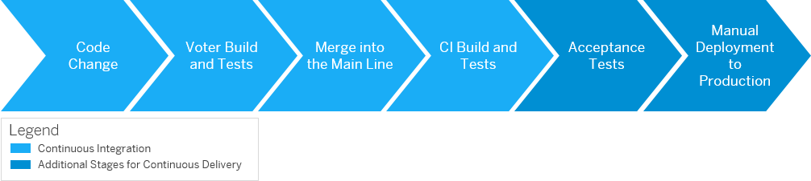

<!-- loio436c92cdb53c40f788e6d60fd8dc9615 -->

# Continuous Integration and Delivery Process Flows

Get an overview of how CI/CD processes work.

The following graphic shows the steps involved in continuous integration and delivery process flows.

> ### Tip:  
> Hover over the arrow shapes for a short description of each step. Click on them for more information.

As described in [What Are Continuous Integration and Continuous Delivery?](what-are-continuous-integration-and-continuous-delivery-5ba483a.md), the continuous delivery concept expands on the one of continuous integration. It adds the aspect that any change that has successfully passed the tests is immediately ready to be deployed to production, both from a technical and a qualitative point of view.

<a name="loio5920d95d05b34f738b430a8b2a958e9e"/>

<!-- loio5920d95d05b34f738b430a8b2a958e9e -->

## 1. Code Change

Create a code change that is based on the latest version of your source code main line.

The first step in a CI/CD process builds on the [Use Version Control](continuous-integration-principles-30b2e1d.md#loio1ea1bfb719754cfea34a2b4cf7289595) principle: Use a source code management system to manage different versions and define a main line.

The developer fetches the latest version of the main line from the source code repository. Based on this version, he or she creates a code change. Later, this code changed is pushed into the source code management system to merge it with the main line again.

<a name="loio02b031ca95f14605a43efc4d50b23089"/>

<!-- loio02b031ca95f14605a43efc4d50b23089 -->

## 2. Voter Build and Tests

Build and test each code change before merging it with the main line.

The second step in a CI/CD process is based on the [Build Each Change](continuous-integration-principles-30b2e1d.md#loio185bf918b2d143119ba081ddcfbf7f77) principle: Use voter builds to automatically build and test each change that goes into the main line.

There are various ways not to directly merge your code change with the main line, so a voter build can check it, first. For example:

-   Push your change into a virtual branch from where it is fetched by the voter build \(as, for example, in [Gerrit Code Review](https://www.gerritcodereview.com/)\)

-   Use a pull request with a separate branch for the feature that is being developed. In this case, the voter build is triggered whenever a commit is pushed into the branch \(as, for example, in [GitHub](https://github.com/)\).

At the beginning of the voter build process, the source code is fetched. This process triggers the CI tool, which manages all build and test requests. It both transforms the sources into binaries \(or another form of artifacts\) and triggers unit tests. As soon as the build is completed, the results are uploaded into an artifact repository. From there, the test tool fetches them and runs the voter build tests.

> ### Tip:  
> Depending on your needs, you can decide whether your voter builds should only contain component tests or if, for example, a virtual runtime is instantiated on the fly to execute some runtime tests, as well.

<a name="loio627438709ea240e4a4f3451bb2c93119"/>

<!-- loio627438709ea240e4a4f3451bb2c93119 -->

## 3. Merge into the Main Line

Integrate your code change into the main line to create a new basis for further development.

If the code change has successfully passed the voter build and tests and meets all other prerequisites you have defined \(for example, we recommend a four-eyes code review\), it can be merged into the main line. Depending on the policies within the development team, this process is either triggered automatically or manually, for example, by the responsible developer him- or herself, the reviewer, or the team architect.

> ### Tip:  
> Use collaboration tools \(for example, [GitHub](https://github.com/), [GitLab](https://about.gitlab.com/), or [Gerrit Code Review](https://www.gerritcodereview.com/)\) to collect the feedback of human code reviewers together with the voter build and test results.

The integration of a code change leads to a new main line version, which serves as basis for further development.

Make sure to adhere to the [Commit Early and Often](continuous-integration-principles-30b2e1d.md#loio8891b4adc29d4f81bd5ce852e4dd4a9c) principle: Integrate your changes into the main line frequently and in small bits.

<a name="loioc1ae4187ec874b669fd752ca2eb24f1c"/>

<!-- loioc1ae4187ec874b669fd752ca2eb24f1c -->

## 4. CI Build and Tests

Build your code change to check the build integrity of the main line.

The fourth step of a CI/CD process adheres to the [Automate the Build](continuous-integration-principles-30b2e1d.md#loio228e3ab64e9343bbb5ac4dc1e60585c0) principle: Test your changes through an automated build.

Merging a code change into the main line automatically triggers the CI build. From a technical point of view, the build procedure equals the one for voter builds: The change is built and tested to a suitable extend to check the build integrity of the main line. After this step, the change is successfully integrated into the main line.

Now, there are two options on how to proceed:

-   Following the concept of continuous integration, the process starts over, again. See [What Are Continuous Integration and Continuous Delivery?](what-are-continuous-integration-and-continuous-delivery-5ba483a.md).

-   Following the concept of continuous delivery, you can run additional tests and manually deploy the new main line version to production, if needed. See the following steps.

<a name="loio1c8e735ce6844280b87eecf025b625e3"/>

<!-- loio1c8e735ce6844280b87eecf025b625e3 -->

## 5. Acceptance Tests

Execute acceptance tests to ensure that your software could be deployed to production at any time.

In a continuous delivery scenario, the change does not only have to be successfully integrated into the main line but after each change, the product must be of such high quality that it could potentially be released and deployed to production. To ensure this quality, the change is deployed to an acceptance test system, which corresponds to the productive runtime system. See [Test in a Production Environment Clone](continuous-integration-principles-30b2e1d.md#loio6e6e2b7e62ec4d48abf2545a94af055f).

Acceptance tests are rather time-consuming and during their execution, the system must me stable and undisturbed by any additional changes. Therefore, not all built changes are acceptance tested. Instead, there are two options on how to decide which of them to check:

-   Implement an automatism, which at a fixed time each date, tests the last successful CI build.

-   The quality manager \(or any other responsible person\) consciously chooses the test candidates and manually triggers their acceptance testing.

> ### Tip:  
> Although you should automate your tests as far as possible, make sure to include some manual testing, as well.

<a name="loio3b9be9303ff4470aa98d9ef586ca58e2"/>

<!-- loio3b9be9303ff4470aa98d9ef586ca58e2 -->

## 6. Manual Deployment to Production

Consciously decide on when to release a specific software version.

If a change has successfully passed all acceptance tests, it is ready to be deployed to the production system. As in most cases, a human \(such as a release manager or application operator\) must assume responsibility for the shipment and explicitly decide whether or not to release, the deployment to product is triggered manually. However, you can use an automated framework to support this manual step. See [Automate the Deployment](continuous-integration-principles-30b2e1d.md#loio93d17b9f501347c29d0c4baf48474d04).

