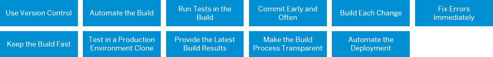
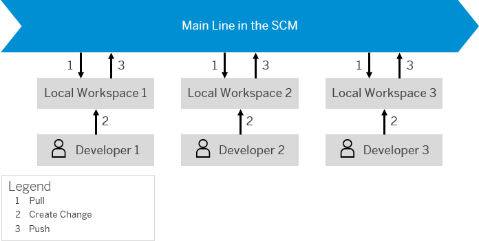
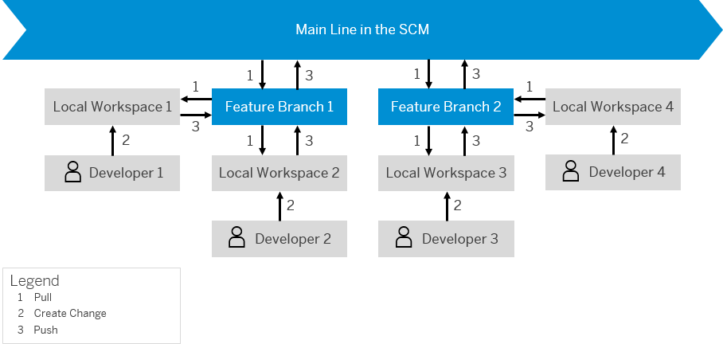
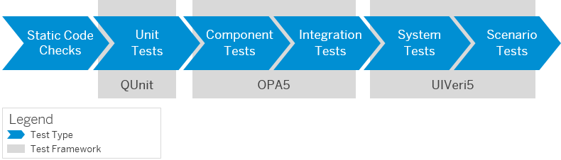
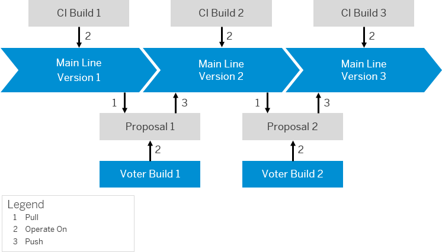
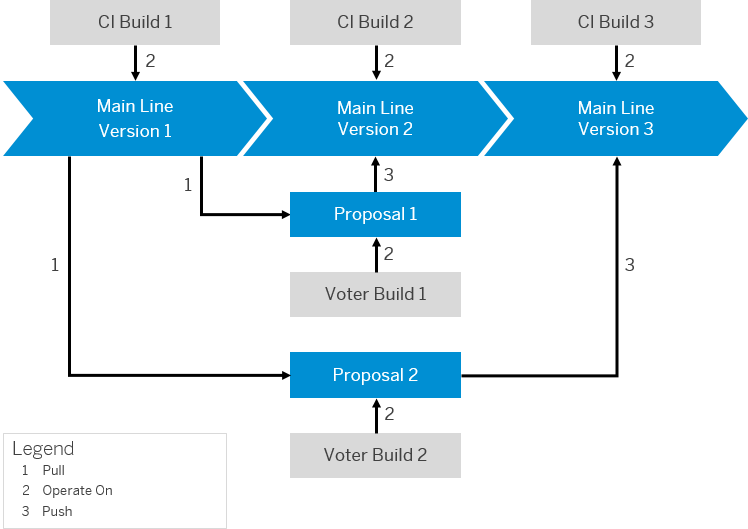
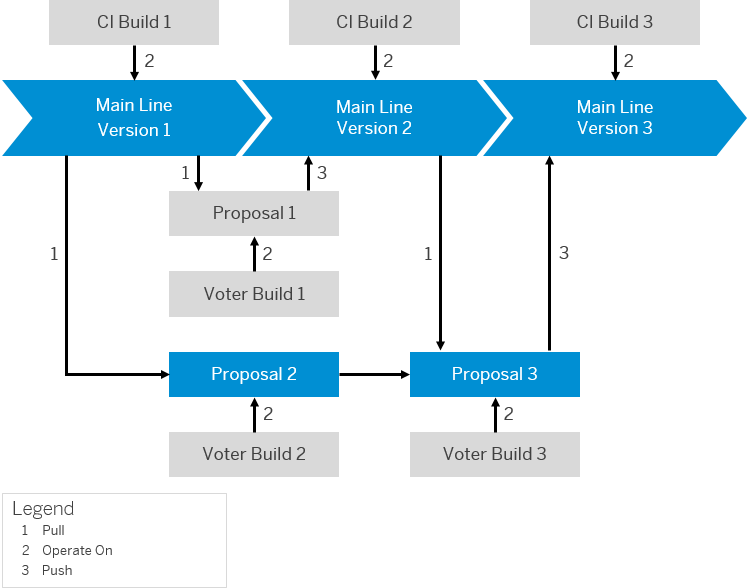
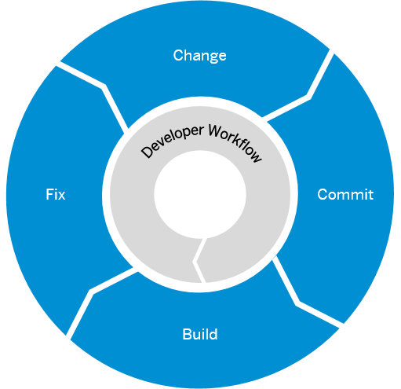

<!-- loio30b2e1d48f634b03a29733c9f88ef688 -->

# Continuous Integration Principles

Learn about the principles that help you implement continuous integration.

The continuous integration process, which is the basis of CI/CD, is based on the following principles:

> ### Tip:  
> Hover over the blue boxes for a short description of each principle. Click on them for more information.

<a name="loio1ea1bfb719754cfea34a2b4cf7289595"/>

<!-- loio1ea1bfb719754cfea34a2b4cf7289595 -->

## Use Version Control

Use a source code management system to manage different versions and define a main line.

In collaborative development, various software engineers work on the same product and often both fix existing bugs and develop further features at the same time. Use a **source code management system \(SCM\)** to make all contributions transparent and avoid clashes between them.

An SCM defines a common **main line** for a product’s source code, from which the contributing developers fetch their sources and to which they push their changes. It assumes that each change of the source code creates a new version and helps managing them by adding a timestamp, the responsible developer’s identity, and a commit message shortly explaining their content. An SCM therefore allows you to track changes as well as to back up and restore single versions, if necessary.

Through its main line, the SCM also provides a single source of truth for other systems, such as the artifact repository. It therefore is the leading system in a landscape and its health must be ensured by all means.

<a name="loio1ea1bfb719754cfea34a2b4cf7289595__section_q54_kng_vhb"/>

## Basic Flow When Working with a Main Line

The following figure shows the basic flow when working with a main line:

  
  
**Basic Flow When Working with a Main Line**

For each developer contributing to a collaborative development project, working with a main line in the SCM comprises the following steps:

1.  The developer pulls the current version of the mail line into his or her local SCM repository.

2.  Based on this copy of the main line, the developer creates a code change on his or her local workspace.
3.  To integrate his or her code change with the main line and thereby create a new version that serves as a basis for further development, the developer pushes it to the main line on the SCM repository server, into which it is merged.

Merging brings the endpoints of two different working lines together. Before doing that, you should rebase your changes by fetching the current version of the main line and merging it into your local changes. As a result, your local change becomes a successor of the current main line version, which makes the change history a linear flow. After having rebased, you can push your changes safely without risking any regressions. Your changes become part of the latest snapshot and can be pulled by other contributors.

<a name="loio1ea1bfb719754cfea34a2b4cf7289595__section_zvv_z4g_vhb"/>

## Working with Feature Branches

In more complex scenarios, the basic flow when working with a main line might not be sufficient. This is the case if, for example, a large number of developers contribute to the same project or not all changes are meant to be integrated into the main line at once. Especially in huge organizations, it is a common practice to initially isolate bigger features and prototypes and integrate them into the main line later.

In these scenarios, you can use **feature branches**, which are temporary children of the main line and work as integration branches. This means that if you contribute to a collaborative feature, you do not directly pull from and push to the main line but the respective feature branch.

The following figure shows the flow when working with feature branches:

  
  
**Working with Feature Branches**

> ### Tip:  
> When a feature is about to be integrated, you must rebase all changes in the feature branch to the current version of the main line. As this can cause a high merging effort, make sure that you rebase your changes as frequently as possible.

<a name="loio228e3ab64e9343bbb5ac4dc1e60585c0"/>

<!-- loio228e3ab64e9343bbb5ac4dc1e60585c0 -->

## Automate the Build

Test your changes through an automated build.

Set up an automated and standardized central build to get feedback on your changes. Building them is the only way to find out whether your project is clean or broken from a build perspective. Automating this process makes it more convenient and motivates for executing it. If you build and test frequently, you can enhance the quality of your code and, at the same time, save valuable working time as you do not have to cumbersomely look for error sources at the end of your development process.

Make sure that in the build description, you specify the conditions under which you have achieved your build result. Documenting your build environment as well as the tools and parameters you have used makes your build result reproducible, if necessary. This might be the case, for example, if you have to find our why your build was successful on your local machine but does not work on another.

> ### Tip:  
> Use a **build scheduler** to operate your build infrastructure. It offers a convenient UI to both trigger and monitor your builds and provides interfaces to integrate them with other components of the CI process. One of the most prominent build schedulers is [Jenkins](https://jenkins.io/).

<a name="loioca228b2312574005b05cc7ccab6f69be"/>

<!-- loioca228b2312574005b05cc7ccab6f69be -->

## Run Tests in the Build

Integrate as many automated tests as possible into your build.

To avoid failures and regressions right from the beginning, make sure that you run comprehensive tests during your build. This approach saves you the working time you would otherwise need to find and fix bugs later in your development.

There are different test types from which you can choose. The following ones are most common:

-   **Static code checks** examine the source code without executing it.

-   **Unit tests** or **component tests** check individual code units such as individual functions or procedures for their functionality. They build the basis for **integration tests**, which check the interplay between several combined code units.

-   **System tests** check both front-end and back-end and make sure that all pieces work well together. See, for example, [Add Automated System Tests with the SAPUI5 Test Recorder to Your CI/CD Pipeline](https://developers.sap.com/tutorials/cp-cicd-systemtest-recorder.html).

-   **Scenario tests** install the newly built application and test it within a hypothetical scenario whose outcome they evaluate.

> ### Tip:  
> Make sure that you always use both unit and scenario tests and do not only validate your code syntax but also the functional correctness of the product.

You can use various test frameworks for different source technologies, for example, [QUnit](https://qunitjs.com/) for Java and [OPA5](https://blogs.sap.com/2018/10/03/testing-your-sapui5-application-with-opa5/) for SAPUI5 applications, or frameworks that examine graphical user interfaces and browser behavior, such as [UIVeri5](https://github.com/SAP/ui5-uiveri5). Many tools let you run tests that automatically execute software interactions and verify their results.

The following graphic shows the different test types and frameworks in relation to each other:

  
  
**Relation between Different Test Types and Frameworks**

<a name="loio8891b4adc29d4f81bd5ce852e4dd4a9c"/>

<!-- loio8891b4adc29d4f81bd5ce852e4dd4a9c -->

## Commit Early and Often

Integrate your changes into the main line frequently and in small bits.

Continuously committing even smaller code changes into the main line and beginning to do so at an early stage of your development process is the key principle of continuous integration. By following this approach, you can avoid two main obstacles you have to face when working with a main line:

-   As various developers constantly contribute to it, the main line steadily evolves and becomes more complex. The longer you wait before integrating your changes, the more does your local copy of the main line differ from the original. As a result, merging your local changes into it becomes increasingly difficult and time-consuming.

-   The bigger the difference gets between your local copy of the main line and the original, the higher is the risk that it gets instable if you finally commit your changes.

> ### Tip:  
> Whether working directly with the main line or with various feature branches as connecting pieces, push your changes at least once per day.

<a name="loio185bf918b2d143119ba081ddcfbf7f77"/>

<!-- loio185bf918b2d143119ba081ddcfbf7f77 -->

## Build Each Change

Use voter builds to automatically build and test each change that goes into the main line.

<a name="loio185bf918b2d143119ba081ddcfbf7f77__section_jfx_vwh_xhb"/>

## Voter Builds

Each change that is integrated into the main line bears the risk of destabilizing it and by that, affecting other developers who rely on its integrity. To protect the main line from erroneous code, operate automated **voter builds** on your proposals. During a voter build, the continuous integration server automatically builds the proposed change to validate its quality and make sure that it does not harm the main line.

The following figure shows the basic flow when integrating voter builds into the development process:

  
  
**Basic Flow When Using Voter Builds**

The basic flow comprises the following steps:

1.  The developer pulls the current version of the main line.

2.  Based on this version, he or she creates a code change and proposes its merging into the main line.

3.  Before it can be actually integrated, a voter build automatically builds the change, validates it, and provides feedback about the outcome.

4.  If the voter build has been successful, the change is merged into the main line, which results in a new version. This version can then be used as a basis for the next change.

<a name="loio185bf918b2d143119ba081ddcfbf7f77__section_wrv_wwh_xhb"/>

## Optimistic Merges

The higher the frequency of changes to a main line, the higher the chance that some of these changes might overlap. This happens if two \(or more\) changes which have the same basis are created in parallel. As long as they affect different code sections and do not conflict with each other, both can be integrated into the main line through an **optimistic merge**. This means that the second change that is pushed to the main line results in a subsequent version to the one that emerges from the integration of the first change.

The following figure displays this process:

  
  
**Optimistic Merges**

> ### Tip:  
> Most source code repositories offer optimistic merge strategies that work very well without manual intervention.

<a name="loio185bf918b2d143119ba081ddcfbf7f77__section_k34_ywh_xhb"/>

## Manual Rebases

If two changes that have the same basis and are created in parallel overlap, optimistic merges cannot be performed. Instead, the developer whose proposal is integrated second must **manually rebase** it to the main line’s current state so that it merges into it as subsequent version.

The following figure displays this process:

  
  
**Manual Rebases**

To make sure that voter builds and CI builds are reliable, they must run on a separate, reproducible build machine managed by a build operator.

> ### Tip:  
> If you have a more complex development landscape which contains feature branches, set up central voter and CI builds for them, as well. Not implementing automatic builds and tests into your feature branches leads to a much higher integration effort when pushing to the main line.

<a name="loiof1978267fc2c4ff7a825cb1cd024ef63"/>

<!-- loiof1978267fc2c4ff7a825cb1cd024ef63 -->

## Fix Errors Immediately

Keep your main line clean and do not accumulate errors.

If you find that your code contains errors, for example, if one of your builds fails, make sure that you react on them immediately. Each error, once integrated into the main line, affects the entire development team and, at worst, prevents them from working. Also follow this principle when using voter builds to make sure that you don't accumulate more issues from change to change.

Bearing this in mind, the developer workflow should be the following:

  
  
**Developer Workflow**

1.  The developer creates a change.

2.  He or she commits it to the main line.

3.  Before actually merging it with the main line, the change is built and tested.

4.  If the outcome of the test shows any errors, the developer **fixes his or her proposal first before working on a new one**.

<a name="loio4616f0ed98e6467e89e0aadd45f2f994"/>

<!-- loio4616f0ed98e6467e89e0aadd45f2f994 -->

## Keep the Build Fast

Include fast-running tests directly into your CI builds and run more time-consuming ones later.

Automatic build and test steps after the proposal of a change are crucial to prevent errors in the main line. However, building, validating, and especially scenario testing can be very time-consuming.

Therefore, you should differentiate between two different levels of testing:

-   **Fast-running tests:** These tests are crucial for the quality of your main line and comprise checks for the syntactical correctness of your code as well as unit tests and fast-running scenario tests.

    > ### Tip:  
    > Make sure that each change that is integrated into the main line has successfully passed these tests.

-   **Long-running scenario tests:** These tests are necessary to ensure the functionality of your code but take longer than acceptable during a CI build process.

    > ### Tip:  
    > For this kind of tests, run additional scheduled builds that are independent from the CI builds and therefore do not prevent you from working on. Their frequency depends on how often the current main line snapshot should be tested intensively.

<a name="loio6e6e2b7e62ec4d48abf2545a94af055f"/>

<!-- loio6e6e2b7e62ec4d48abf2545a94af055f -->

## Test in a Production Environment Clone

Execute scenario tests on machines that are comparable to the final production landscape.

Different setups and environments at various stages of a production pipeline often cause errors. To make sure that your final product is fully operational on the production landscape, run all scenario tests on machines that are a clone of the production environment.

This production environment clone, however, is difficult to achieve: When using traditional physical hardware with manually installed and configured software, it’s almost impossible to avoid discrepancies. Across time, production and test machines, or any two different environments, automatically diverge.

To address this issue, treat setup and configuration the same way as writing code \(this principle is sometimes referred to as **Infrastructure as Code \(IaC\)**, which is an important cornerstone of DevOps\): Describe any software and configuration installed on a machine in source files. This procedure enables you to re-create the machine setup at any time. If you use automation tools such as [SaltStack](https://www.saltstack.com/), you can roll out changes in a controlled and reproducible way, which is especially well suited when working with virtual hardware: Setting up new virtual machines, providing them with the necessary software, and putting them into production can be completely automated.

> ### Tip:  
> Run your applications in containers that are instantiated from predefined images \(like in [Docker](https://www.docker.com/?utm_medium=PPC&utm_source=Adwords&utm_term=docker&utm_target=aud-558719800540:kwd-43721580&utm_campaign=1894083085&utm_content=Homepage&gclid=Cj0KCQjwi43oBRDBARIsAExSRQFlGCXzLd8GCL2WBiHrt3X-Lxx5XgjWSZMwkNDarMImkkp_6dtNao0aAm-yEALw_wcB)\) instead of installing them directly on your hardware. This approach makes the setup of the machine reproducible at any time.

<a name="loiofc4bdc5eafd943b3a8fd1afef1981303"/>

<!-- loiofc4bdc5eafd943b3a8fd1afef1981303 -->

## Provide the Latest Build Results

Set up a central location for your artifact versions.

For security reasons and to minimize the risk of spoiling build results, the build servers should run without being disturbed by any unauthorized access. This approach, however, also means that developers with a valid interest in getting the latest build result cannot be allowed to download it directly from the build server. Therefore, you should maintain a central location to store and provide artifact versions.

When choosing a central location for managing your software artifacts, make sure that one can easily find what he or she is looking for. Only keep official builds and make sure that unauthorized changes on the artifacts \(such as the manual replacement of build results\) are not allowed.

However, storing your artifacts in a central share can be problematic, for example in the following cases:

-   You want to store more than one application.

-   You want to keep more than one application.

-   Your application has to be built for more than one platform.

-   You need more than one build variant.

> ### Tip:  
> Use a **central repository** for artifacts to store and provide build results for both developers and processes that rely on them. For example, [Nexus Repository](https://www.sonatype.com/nexus-repository-sonatype) is a repository manager for Java software.

<a name="loio738e133e38c34805b0e7341ebc0b3ef0"/>

<!-- loio738e133e38c34805b0e7341ebc0b3ef0 -->

## Make the Build Process Transparent

Implement a single entry point to receive information about the build status.

After being committed by a developer, the change follows the CI process chain, which involves several components such as the source code management system, build scheduler, test landscape, and artifact repository. At any point in time, it is processed by one of the mentioned tools and in a dedicated stage, for example, being pushed, successfully or erroneously built, or tested.

To make the information about status and processing tool of a change easy to access, establish a central entry point that provides answers to the following main questions:

-   **Was the last change built?**

-   **Was it tested?**

-   **What are the build and test results?**

-   **Was the change merged into the main line?**

> ### Tip:  
> Use an orchestration tool that both controls the entire process pipeline and provides information on the process status.

<a name="loio93d17b9f501347c29d0c4baf48474d04"/>

<!-- loio93d17b9f501347c29d0c4baf48474d04 -->

## Automate the Deployment

Deploy automatically after each build and manually trigger the automatic deployment to your production systems.

Deployment, which is the installation of an application to a runtime system, should be done automatically. You can automate your deployment in different ways and for different purposes:

-   You can implement **automated scenario tests** that either already run in the build or as a separate process triggered by or after the build. These scenario tests must connect to a running application and are part of the acceptance process for a change proposed or committed by a developer.

-   You can use a **single runtime system** \(for example, a JEE server\) **that waits for deployments**. This approach can be sufficient in the beginning, but also has some disadvantages:

    -   Since it is a single instance, you must serialize the test requests to avoid clashes.

    -   A high number of changes makes the instance a bottleneck.

    -   Reusing the same instance again and again bears the risk of degenerating the system over time.

    A better approach is to install and start the runtime system on demand during the build. You can either use the temporary file system dedicated to the single test execution instance or by using container technology \(for example, Docker\) for bringing up the runtime system on demand in a well-defined state.

-   You can provision a **test system for manual tests**. This approach, however, might not be appropriate in CI build scenarios as frequency and time of the validation of new commits are often not predictable. Instead, provision manual test systems from a scheduled build that runs, for example, daily at a given time, deploys to the test system, and notifies the tester after the successful deployment. In this case, a single runtime instance dedicated for this purpose is sufficient. This approach also supports a staged environment with several test instances of different quality levels.

-   You can fully automate the deployment into the productive environment. You should, however, only choose this approach if the risk of breaking something is minimized, which means that manual tests are not needed, anymore, and all other tests are automated.

We recommend **manually deploying to production after a conscious release decision**. However, this manual step should be **supported by an automated framework** as much as possible: When, for example, pressing a “Release” button, the process framework should automatically start the deployment job to the productive system.

> ### Remember:  
> Continuous delivery doesn’t require each change to be deployed to production automatically. Instead, continuous delivery means that any change that is integrated is being validated and therefore ready to be deployed to production.

