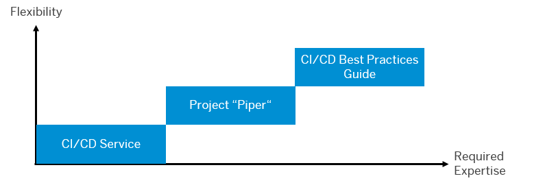

<!-- loioe9fa320181124fa9808d4446a1bf69dd -->

# SAP Solutions for Continuous Integration and Delivery

Get an overview of the solutions SAP provides for continuous integration and delivery.

> ### Note:  
> For links to all SAP solutions for CI/CD, blog posts, presentations, and tutorials, have a look at our [Continuous Integration and Delivery by SAP](https://help.sap.com/viewer/product/CICD_OVERVIEW/Cloud/en-US?task=discover_task) overview.

<a name="loioe9fa320181124fa9808d4446a1bf69dd__section_tlr_g4n_nkb"/>

## Use

At the moment, SAP offers three different solutions that help you apply CI/CD in your software development:

-   [**SAP Continuous Integration and Delivery**](https://help.sap.com/viewer/product/CONTINUOUS_DELIVERY/Cloud/en-US)

    SAP Continuous Integration and Delivery is a service on SAP BTP, which lets you configure and run predefined continuous integration and delivery pipelines that build, test, and deploy your code changes. It supports the development of SAP Cloud Application Programming Model, SAP Fiori, SAP Cloud Integration and container-based applications projects.

    For more information, see [Meet Our New Continuous Integration and Delivery Solution](https://blogs.sap.com/2020/08/17/meet-our-new-continuous-integration-and-delivery-solution/).

-   **[Project "Piper"](https://www.project-piper.io/)**

    Project "Piper" is an open-source project that provides preconfigured Jenkins pipelines, which you can use in your own Jenkins infrastructure and adapt according to your needs, if necessary. It consists of two components:

    -   A [shared library](https://github.com/SAP/jenkins-library), which contains the description of steps, scenarios, and utilities required to use Jenkins pipelines

    -   A [set of Docker images](https://github.com/SAP/devops-docker-images) that can be used to implement best practice processes

-   **[Continuous Integration and Delivery Best Practices Guide](https://help.sap.com/viewer/3324745951b44b578bd65221d2ff8f9a/Cloud/en-US)**

    The CI/CD Best Practices Guide provides best practice procedures to implement continuous delivery pipelines on any CI/CD stack and demonstrates how to apply the principles of CI/CD to SAP-specific technologies.

    For more information, see [We’ve Finished Our Renovations: Our New CI/CD Best Practices](https://blogs.sap.com/2020/02/20/weve-finished-our-renovations-our-new-ci-cd-best-practices/).

All three solutions differ in their level of flexibility and expertise required for setup and configuration:

> ### Note:  
> In the following image, click on one of the blue boxes to navigate to the corresponding solution.

As you don't need to care about the underlying infrastructure, SAP Continuous Integration and Delivery requires the least expertise in CI/CD. Therefore, however, its flexibility is limited. Project "Piper" Docker images can be used out-of-the-box. As this offering depends on Jenkins, however, its flexibility is also restricted. The Continuous Integration and Delivery Best Practices Guide works with any CI/CD stack, but therefore requires more expertise in CI/CD.

<a name="loioe9fa320181124fa9808d4446a1bf69dd__section_kl1_g4n_nkb"/>

## Learn and Get Certified

Depending on your learning goals and level of expertise, you can choose from the following offerings:

-   **[Continuous Integration and Delivery by SAP Learning Journey](https://help.sap.com/doc/221f8f84afef43d29ad37ef2af0c4adf/HP_2.0/en-US/b76f0b2e5d534c449c1f3b0fa84ab697.html)**

    Our learning journey is a visual guide that helps you complete the learning path for CI/CD by SAP. It makes you understand the practices and principles of continuous integration and delivery, provides the opportunity to gather hands-on experience, and helps you improve your skills in CI/CD.

    For more information about Learning Journeys, see [Jump-start your Learning](https://help.sap.com/doc/221f8f84afef43d29ad37ef2af0c4adf/HP_2.0/en-US/0d7dd0dc8f464586a187b9b6c27c6b23.html).

-   **[Continuous Integration and Delivery Introduction Guide](https://help.sap.com/viewer/ee5a61247061455ab232c19179fe4c3b/Cloud/en-US)**

    The CI/CD Introduction Guide provides you with basic knowledge for setting up and implementing continuous integration and delivery processes. It gives an overview of the concepts and principles of CI/CD, explains both procedures and their relation, and helps you plan your own CI/CD process.

<a name="loioa49d1ba1ecef4e9d96deffd127c4522d"/>

<!-- loioa49d1ba1ecef4e9d96deffd127c4522d -->

## Which SAP Solution for CI/CD Meets Your Needs?

Find your appropriate SAP solution for continuous integration and delivery.

The following table shows which development scenarios are covered by which SAP solutions for CI/CD. Look for your specific use case to get a link to our appropriate solution.

> ### Tip:  
> In the table, use the search options to quickly find what you are looking for.

**CI/CD Scenarios and Matching Offerings by SAP**

<table>
<tr>
<th valign="top">

Development Scenario

</th>
<th valign="top">

Environment

</th>
<th valign="top">

SAP Continuous Integration and Delivery 

</th>
<th valign="top">

Project "Piper"

</th>
<th valign="top">

Continuous Integration and Delivery Best Practices Guide

</th>
</tr>
<tr>
<td valign="top">

Developing SAPUI5/SAP Fiori applications on SAP BTP

</td>
<td valign="top">

Cloud Foundry

Neo

</td>
<td valign="top">

See

-   [SAP Fiori in the Cloud Foundry Environment](https://help.sap.com/viewer/99c72101f7ee40d0b2deb4df72ba1ad3/Cloud/en-US/8887fe3c5445442b915d3c066c010d75.html)

-   [SAP Fiori in the Neo Environment](https://help.sap.com/viewer/99c72101f7ee40d0b2deb4df72ba1ad3/Cloud/en-US/1302e9ae408b4dc38d7109c75db9aa75.html)

</td>
<td valign="top">

See [Build and Deploy SAPUI5/SAP Fiori Applications on SAP BTP](https://www.project-piper.io/scenarios/ui5-sap-cp/Readme/).

</td>
<td valign="top">

See [Apply CI/CD to SAP Fiori Development on SAP BTP](https://help.sap.com/viewer/3324745951b44b578bd65221d2ff8f9a/Cloud/en-US/1fd3a82e80b34a8a807c880850d64e11.html).

</td>
</tr>
<tr>
<td valign="top">

Developing SAPUI5/SAP Fiori applications on an SAP Fiori front-end server

</td>
<td valign="top">

ABAP

</td>
<td valign="top">

See [SAP Fiori for the ABAP Platform](https://help.sap.com/docs/CONTINUOUS_DELIVERY/99c72101f7ee40d0b2deb4df72ba1ad3/5a4ec31140e74970866fcd776cd856f1.html?version=Cloud).

</td>
<td valign="top">

See [Build an SAP Fiori Application and Attach It to a Transport Request on an ABAP System](https://www.project-piper.io/scenarios/upload-to-transportrequest/Readme/).

</td>
<td valign="top">

See [Apply CI/CD to SAP Fiori Development on an SAP Fiori Front-End Server](https://help.sap.com/viewer/3324745951b44b578bd65221d2ff8f9a/Cloud/en-US/3713b07025274c2fbc95467627921a7a.html).

</td>
</tr>
<tr>
<td valign="top">

Developing SAP HANA extended application services, advanced model applications

</td>
<td valign="top">

SAP HANA

</td>
<td valign="top">

\-

</td>
<td valign="top">

See [Build and Deploy SAP Fiori Applications on SAP HANA Extended Application Services, Advanced Model](https://www.project-piper.io/scenarios/xsa-deploy/Readme/).

</td>
<td valign="top">

See [Apply CI/CD to SAP HANA Extended Application Services, Advanced Model Development](https://help.sap.com/viewer/3324745951b44b578bd65221d2ff8f9a/Cloud/en-US/55242ddaa08d4f3190fd06171b5f85f5.html).

</td>
</tr>
<tr>
<td valign="top">

Developing applications with the SAP Cloud Application Programming Model

</td>
<td valign="top">

Cloud Foundry

</td>
<td valign="top">

See [SAP Cloud Application Programming Model](https://help.sap.com/viewer/99c72101f7ee40d0b2deb4df72ba1ad3/Cloud/en-US/bfe48a4b12ed41868f92fa564829f752.html).

</td>
<td valign="top">

See [Build and Deploy SAP Cloud Application Programming Model Applications](https://www.project-piper.io/scenarios/CAP_Scenario/).

</td>
<td valign="top">

\-

</td>
</tr>
<tr>
<td valign="top">

Developing with SAP Cloud Transport Management

</td>
<td valign="top">

Cloud Foundry

Neo

</td>
<td valign="top">

See

-   [SAP Cloud Application Programming Model](https://help.sap.com/viewer/99c72101f7ee40d0b2deb4df72ba1ad3/Cloud/en-US/bfe48a4b12ed41868f92fa564829f752.html)

-   [SAP Fiori in the Cloud Foundry Environment](https://help.sap.com/viewer/99c72101f7ee40d0b2deb4df72ba1ad3/Cloud/en-US/8887fe3c5445442b915d3c066c010d75.html)

-   [SAP Fiori in the Neo Environment](https://help.sap.com/viewer/99c72101f7ee40d0b2deb4df72ba1ad3/Cloud/en-US/1302e9ae408b4dc38d7109c75db9aa75.html)

</td>
<td valign="top">

See [Integrate SAP Cloud Transport Management Into Your CI/CD Pipeline](https://www.project-piper.io/scenarios/TMS_Extension/).

</td>
<td valign="top">

See [Integrate SAP Cloud Transport Management Into Your CI/CD Pipeline](https://help.sap.com/viewer/3324745951b44b578bd65221d2ff8f9a/Cloud/en-US/6b27ecd7ecbf46a7bfea5e940f4d6412.html).

</td>
</tr>
<tr>
<td valign="top">

Developing with SAP Solution Manager

</td>
<td valign="top">

Neo

</td>
<td valign="top">

\-

</td>
<td valign="top">

See [Build and Deploy Hybrid Applications with SAP Solution Manager](https://www.project-piper.io/scenarios/changeManagement/).

</td>
<td valign="top">

See [Integrate Change Request Management with SAP Solution Manager into Your CI/CD Pipeline](https://help.sap.com/viewer/3324745951b44b578bd65221d2ff8f9a/Cloud/en-US/c13a897bd1b54ad4904c5ea298e382ea.html).

</td>
</tr>
<tr>
<td valign="top">

Developing with SAP Integration Suite

</td>
<td valign="top">

Cloud Foundry

</td>
<td valign="top">

See [SAP Integration Suite Artifacts](https://help.sap.com/viewer/SAP-Cloud-Platform-Continuous-Integration-and-Delivery/019ed685a19b4efab4f7df0e108d1697.html).

</td>
<td valign="top">

See project "Piper" library steps

-   [integrationArtifactDeploy](https://www.project-piper.io/steps/integrationArtifactDeploy/)

-   [integrationArtifactDownload](https://www.project-piper.io/steps/integrationArtifactDownload/)

-   [integrationArtifactGetMplStatus](https://www.project-piper.io/steps/integrationArtifactGetMplStatus/)

-   [integrationArtifactGetServiceEndpoint](https://www.project-piper.io/steps/integrationArtifactGetServiceEndpoint/)
-   [integrationArtifactResource](https://www.project-piper.io/steps/integrationArtifactResource/)
-   [integrationArtifactUnDeploy](https://www.project-piper.io/steps/integrationArtifactUnDeploy/)
-   [integrationArtifactUpdateConfiguration](https://www.project-piper.io/steps/integrationArtifactUpdateConfiguration/)
-   [integrationArtifactUpload](https://www.project-piper.io/steps/integrationArtifactUpload/)
-   [apiProxyUpload](https://www.project-piper.io/steps/apiProxyUpload/)
-   [apiProxyDownload](https://www.project-piper.io/steps/apiProxyDownload/)
-   [apiKeyValueMapDownload](https://www.project-piper.io/steps/apiKeyValueMapDownload/)

See also the blog post [Working with Integration Suite Piper Commands](https://blogs.sap.com/2022/01/05/working-with-integration-suite-piper-commands/).

</td>
<td valign="top">

\-

</td>
</tr>
<tr>
<td valign="top">

Developing container-based applications

</td>
<td valign="top">

Kyma

</td>
<td valign="top">

See [Container-Based Applications](https://help.sap.com/viewer/SAP-Cloud-Platform-Continuous-Integration-and-Delivery/10970393828c46498806d1b322cf05a4.html).

</td>
<td valign="top">

See [General Purpose Pipeline](https://www.project-piper.io/stages/introduction/) with build tool `docker`.

</td>
<td valign="top">

\-

</td>
</tr>
</table>

