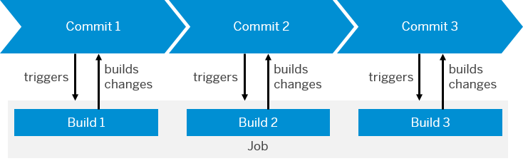

<!-- loio707017c681aa4bc09d0279f08115dcae -->

# Concepts

Get to know the basic terms in SAP Continuous Integration and Delivery.

In the continuous integration and delivery service, the following concepts are fundamental:

<a name="loio707017c681aa4bc09d0279f08115dcae__section_dxw_cp3_qnb"/>

## Job and Build

Get to know the **job** and **build** concepts.

<table>
<tr>
<th valign="top">

Concept

</th>
<th valign="top">

Definition

</th>
</tr>
<tr>
<td valign="top">

Job

</td>
<td valign="top">

A job is a recurring and automatic continuous integration and delivery task. It depends on a pipeline, a source repository, and various configuration settings.

</td>
</tr>
<tr>
<td valign="top">

Build

</td>
<td valign="top">

A build is the execution of a job for a specific commit in the source repository. Builds can either be triggered manually or automatically through changes in the repository.

</td>
</tr>
</table>

The following graphic shows how **job** and **build** relate to each other:

  
  
**Relation between Job and Build**

<a name="loio707017c681aa4bc09d0279f08115dcae__section_t3w_dp3_qnb"/>

## Pipeline, Stage, and Step

Get to know the **pipeline**, **stage**, and **step** concepts.

<table>
<tr>
<th valign="top">

Concept

</th>
<th valign="top">

Definition

</th>
</tr>
<tr>
<td valign="top">

Pipeline

</td>
<td valign="top">

A pipeline is the program that is executed within each build. It defines the stages that are executed during the job.

</td>
</tr>
<tr>
<td valign="top">

Stage

</td>
<td valign="top">

A stage is a subtask of a pipeline \(for example, build, integration test, or deploy\). Each stage has a status and a dedicated section in the log.

</td>
</tr>
<tr>
<td valign="top">

Step

</td>
<td valign="top">

A step is a subtask of a stage.

</td>
</tr>
</table>

The following graphic shows how **pipeline**, **stage**, and **step** relate to each other:

  
  
**Relation between Pipeline, Stage, and Step**

**Related Information**  

[What Are Continuous Integration and Continuous Delivery?](https://help.sap.com/viewer/ee5a61247061455ab232c19179fe4c3b/Cloud/en-US/5ba483a2c97b4ad5ab0148f4a6c5a9ee.html "Get an overview of the continuous integration and delivery concepts.")

