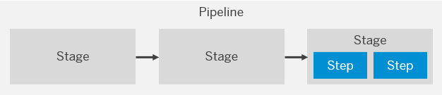
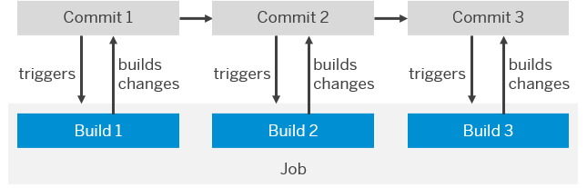
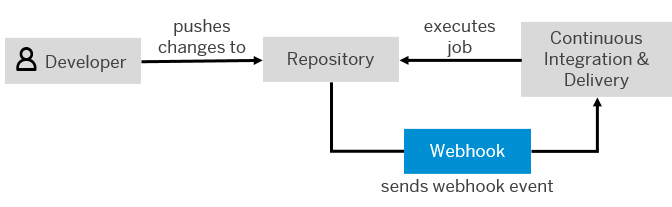

<!-- loio707017c681aa4bc09d0279f08115dcae -->

# Concepts

Get to know the basic terminology that is used in SAP Continuous Integration and Delivery.

<a name="loio707017c681aa4bc09d0279f08115dcae__section_dxw_cp3_qnb"/>

## Pipeline, Stage, and Step

SAP Continuous Integration and Delivery offers predefined CI/CD pipelines for SAP-specific development scenarios. Each **pipeline** consists of various **stages**, that is, tasks \(such as build, integration test, or deploy\), which are executed one after the other. Stages are subdivided into several subtasks, which are referred to as **steps**.

  
  
**Relation between Pipeline, Stage, and Step**

<a name="loio707017c681aa4bc09d0279f08115dcae__section_n1n_3dv_z1c"/>

## Job and Build

Before using an SAP Continuous Integration and Delivery pipeline, you configure it according to your needs. This configuration does not only include the choice of the pipeline type that fits your scenario, but also the selection and adaption of the stages you want it to execute. A configured and thus customized pipeline is called **job**. See [Configuring Jobs](configuring-jobs-e293286.md).

If a job is triggered, the [stages](concepts-707017c.md#loio707017c681aa4bc09d0279f08115dcae__section_dxw_cp3_qnb) you’ve configured are executed in a row. Each execution of a job is referred to as **build**.

  
  
**Relation between Job and Build**

<a name="loio707017c681aa4bc09d0279f08115dcae__section_t3w_dp3_qnb"/>

## Webhook

A build can either be triggered manually in the service user interface or automatically through changes in your source code management repository. To automate your pipeline so that it runs a build with every commit that is made, you need to establish a **webhook** between SAP Continuous Integration and Delivery and your source repository. This webhook sends a push event whenever a change is pushed and thereby triggers a build of the connected job. See [Creating Webhooks](creating-webhooks-a273cff.md).

  
  
**Using a Webhook with SAP Continuous Integration and Delivery**

<a name="loio707017c681aa4bc09d0279f08115dcae__section_mkc_hfv_z1c"/>

## Overview

The following table provides you with a brief definition of each major term in SAP Continuous Integration and Delivery in alphabetical order.

<table>
<tr>
<th valign="top">

Concept

</th>
<th valign="top">

Definition

</th>
</tr>
<tr>
<td valign="top">

Build

</td>
<td valign="top">

A build is the execution of a job for a specific commit in the source repository. Builds can either be triggered manually or automatically through changes in the repository.

</td>
</tr>
<tr>
<td valign="top">

Job

</td>
<td valign="top">

A job is a recurring and automatic continuous integration and delivery task. It depends on a pipeline type, a source repository, and various configuration settings.

</td>
</tr>
<tr>
<td valign="top">

Pipeline

</td>
<td valign="top">

A pipeline is the program that is executed within each build. It defines the stages that are executed during the job.

</td>
</tr>
<tr>
<td valign="top">

Stage

</td>
<td valign="top">

A stage is a subtask of a pipeline \(for example, build, integration test, or deploy\). Each stage has a status and a dedicated section in the log.

</td>
</tr>
<tr>
<td valign="top">

Step

</td>
<td valign="top">

A step is a subtask of a stage.

</td>
</tr>
<tr>
<td valign="top">

Webhook

</td>
<td valign="top">

Webhooks are a way for web applications to send real-time notifications or data to other applications when certain events occur. This allows for automatic communication and integration between different systems.

</td>
</tr>
</table>

**Related Information**  

[What Are Continuous Integration and Continuous Delivery?](https://help.sap.com/viewer/ee5a61247061455ab232c19179fe4c3b/Cloud/en-US/5ba483a2c97b4ad5ab0148f4a6c5a9ee.html "Get an overview of the continuous integration and delivery concepts.")

