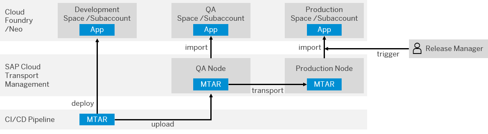

<!-- loio619a864813584bd1a433cafac1fb0c1e -->

<link rel="stylesheet" type="text/css" href="css/sap-icons.css"/>

# Configure an SAP Fiori in the Neo Environment Job in the Job Editor

Configure the stages of your SAP Fiori in the Neo environment job directly in the SAP Continuous Integration and Delivery service.


<a name="loio619a864813584bd1a433cafac1fb0c1e__prereq_dvs_hg3_xlb"/>

## Prerequisites

-   You’re an administrator of SAP Continuous Integration and Delivery. See [Assigning Roles and Permissions](assigning-roles-and-permissions-c679ebd.md).

-   In your source code management system, you have an SAPUI5/SAP Fiori project for the Neo environment.


<a name="loio619a864813584bd1a433cafac1fb0c1e__context_plr_4hy_q4b"/>

## Context

Depending on your configuration, the SAP Fiori in the Neo environment pipeline can comprise the following stages:

> ### Tip:  
> Hover over the arrow shapes for a short description of each stage.


> ### Note:  
> Upon the completion of your pipeline’s run, an additional *Declarative: Post Actions* stage is executed to perform finalization tasks. The outcome of the *Declarative: Post Actions* stage does not influence the success of your build.


<a name="loio619a864813584bd1a433cafac1fb0c1e__steps_yz5_sh3_xlb"/>

## Procedure

1.  In SAP Continuous Integration and Delivery, configure a new job as described in [Create a Job](create-a-job-d748920.md). As *Pipeline*, choose *SAP Fiori in the Neo Environment*.

2.  In the *Stages* tab, choose *Job Editor* from the *Configuration Mode* dropdown list.

    > ### Note:  
    > After you have configured your job, you can export the editor-based configuration information to a YAML file by pressing the YML button. Press *Edit* and switch to *Source Repository* to move from editor-based configuration to the more advanced configuration in the source repository when necessary. For more information, see [\(Optional\) Export Job Configuration Data](https://help.sap.com/viewer/99c72101f7ee40d0b2deb4df72ba1ad3/Cloud/en-US/60a76d7b5a2a46f684515b18e9cbbc08.html).

3.  In the *Stages* tab, perform the following actions:

    1.  Configure the *Build* stage.

        **Actions for Configuring the Build Stage**


        <table>
        <tr>
        <th valign="top">

        Step
        
        </th>
        <th valign="top">

        Parameter
        
        </th>
        <th valign="top">

        Action
        
        </th>
        </tr>
        <tr>
        <td valign="top" rowspan="3">
        
         
        
        </td>
        <td valign="top">
        
        State
        
        </td>
        <td valign="top">
        
        Either switch the execution of the *Build* stage on or off.
        
        </td>
        </tr>
        <tr>
        <td valign="top">
        
        Build Tool Version
        
        </td>
        <td valign="top">
        
        Choose the build tool version you want to use. For more information, see [Supported Tools](supported-tools-5949283.md).

        If you don't define a build tool version, a default one \(`MBTJ17N18`\) is used.
        
        </td>
        </tr>
        <tr>
        <td valign="top">
        
        Application Name
        
        </td>
        <td valign="top">
        
        Optionally, enter a name for your application.

        > ### Note:  
        > The build prefers the application name from your MTA descriptor file over the one entered in the user interface. If you don't define an application name \(neither in the `mta.yaml` file nor in the user interface\), a default one \(`ui5application`\) is used.


        
        </td>
        </tr>
        <tr>
        <td valign="top">
        
        Lint Check
        
        </td>
        <td valign="top">
        
        State
        
        </td>
        <td valign="top">
        
        Either switch the execution of the *Lint Check* step on or off.

        The lint check verifies the syntax of your JavaScript code.

        If you want your build to fail if the *Lint Check* reveals any errors, check the *Fail on Error* checkbox.
        
        </td>
        </tr>
        </table>
        
    2.  Configure the *Additional Unit Tests* stage.

        **Actions for Configuring Additional Unit Tests**


        <table>
        <tr>
        <th valign="top">

        Parameter
        
        </th>
        <th valign="top">

        Action
        
        </th>
        </tr>
        <tr>
        <td valign="top">
        
        State
        
        </td>
        <td valign="top">
        
        Either switch the execution of the *Additional Unit Tests* stage on or off. If you switch it on, make sure that you have a `package.json` file on the root level, which points to the test sources that should be executed.
        
        </td>
        </tr>
        <tr>
        <td valign="top">
        
        npm Script
        
        </td>
        <td valign="top">
        
        \(Optional\) If in your `package.json` file, you have a `scripts` section, specify the name of the test script to be executed.
        
        </td>
        </tr>
        </table>
        
    3.  Configure the *Malware Scan* stage.

        **Actions for Configuring the Malware Scan Step**


        <table>
        <tr>
        <th valign="top">

        Parameter
        
        </th>
        <th valign="top">

        Action
        
        </th>
        </tr>
        <tr>
        <td valign="top">
        
        State
        
        </td>
        <td valign="top">
        
        Either switch the execution of the *Malware Scan* stage on or off.
        
        </td>
        </tr>
        </table>
        
    4.  Configure the *Acceptance* stage.

        **General Actions for the Acceptance Stage**


        <table>
        <tr>
        <th valign="top">

        Parameter
        
        </th>
        <th valign="top">

        Action
        
        </th>
        </tr>
        <tr>
        <td valign="top">
        
        State
        
        </td>
        <td valign="top">
        
        Either switch the execution of the *Acceptance* stage on or off.
        
        </td>
        </tr>
        </table>
        
        **Actions for Configuring the Deploy to Neo Acceptance Subaccount Step**


        <table>
        <tr>
        <th valign="top">

        Parameter
        
        </th>
        <th valign="top">

        Action
        
        </th>
        </tr>
        <tr>
        <td valign="top">
        
        Host
        
        </td>
        <td valign="top">
        
        Enter the host of your SAP BTP subaccount. See [Regions and Hosts Available for the Neo Environment](https://help.sap.com/viewer/ea72206b834e4ace9cd834feed6c0e09/Cloud/en-US/d722f7cea9ec408b85db4c3dcba07b52.html).
        
        </td>
        </tr>
        <tr>
        <td valign="top">
        
        Subaccount ID
        
        </td>
        <td valign="top">
        
        Enter the ID of your SAP BTP subaccount.

        It’s displayed as *Technical Name* in the overview of your subaccount in the SAP BTP cockpit.
        
        </td>
        </tr>
        <tr>
        <td valign="top">
        
        Credentials
        
        </td>
        <td valign="top">
        
        Choose *Create Credentials* and create an OAuth credential for the subaccount to in which you want to test your application. See [Configure the Deploy Credential](configure-an-sap-fiori-in-the-neo-environment-job-in-your-repository-4f6185c.md#loio52bc22233ef84527bc409fbe748947b8).

        Choose this credential from the dropdown list.
        
        </td>
        </tr>
        </table>
        
        **Actions for Configuring the UIVeri5 Test \(Deprecated\) Step**


        <table>
        <tr>
        <th valign="top">

        Parameter
        
        </th>
        <th valign="top">

        Action
        
        </th>
        </tr>
        <tr>
        <td valign="top">
        
        State
        
        </td>
        <td valign="top">
        
        > ### Note:  
        > **Please note that this step is deprecated and will be removed or replaced soon.** Even though existing tests will continue to work, we recommend that you remove the deprecated configurations. For more details, see [GitHub](https://github.com/SAP/ui5-uiveri5#readme).

        Either switch the execution of the UIVeri5 test on or off.
        
        </td>
        </tr>
        <tr>
        <td valign="top">
        
        Configuration Path
        
        </td>
        <td valign="top">
        
        Enter the path to the configuration file in your repository, for example:`.app/webapp/test/univeri5/conf.js` 
        
        </td>
        </tr>
        <tr>
        <td valign="top">
        
        Base URL
        
        </td>
        <td valign="top">
        
        Enter the URL of the application against which the UiVeri5 tests should be executed. See [Configuring Application URLs](https://help.sap.com/viewer/ea72206b834e4ace9cd834feed6c0e09/Cloud/en-US/7ceeaa5e528140c48ae53b68433293ba.html).
        
        </td>
        </tr>
        <tr>
        <td valign="top">
        
        Application Credentials
        
        </td>
        <td valign="top">
        
        \(Optional\) To authenticate your pipeline against the application, create a Basic Authentication credential of a user, who has the appropriate permissions. See [Creating Credentials](creating-credentials-6658c81.md).

        > ### Tip:  
        > Avoid using a technical user credential and create a special test user instead.

        Choose this credential from the dropdown list.

        > ### Note:  
        > If you chose to use application credentials, add the following code block to your `conf.js` file in your repository:
        > 
        > ```
        > //Read environment variables
        > const defaultParams = {
        >     user: process.env.TEST_USER,
        >     pass: process.env.TEST_PASS
        > };
        > ```


        
        </td>
        </tr>
        </table>
        
        **Actions for Configuring the WebdriverIO Test Step**


        <table>
        <tr>
        <th valign="top">

        Parameter
        
        </th>
        <th valign="top">

        Action
        
        </th>
        </tr>
        <tr>
        <td valign="top">
        
        State
        
        </td>
        <td valign="top">
        
        > ### Note:  
        > The *WebdriverIO Test* step is available for build tool versions Node 16 and above. The WebdriverIO testing framework is no longer compatible with older Node.js versions.

        Either switch the execution of the *WebdriverIO Test* step on or off.
        
        </td>
        </tr>
        <tr>
        <td valign="top">
        
        npm Script
        
        </td>
        <td valign="top">
        
        Enter the name of the test script to be executed. You can find it in the `scripts` section of your `package.json` file. If you don't define a name, a default one \("`wdi5`"\) is used.
        
        </td>
        </tr>
        <tr>
        <td valign="top">
        
        Base URL
        
        </td>
        <td valign="top">
        
        Enter the URL of the application against which the tests should be executed. See [Configuring Application URLs](https://help.sap.com/viewer/65de2977205c403bbc107264b8eccf4b/Cloud/en-US/e623e372e6174f81af2b9b8ef8f6d6d3.html).

        > ### Tip:  
        > If you don't know the URL, you can deploy your application first. You will find the generated URL by navigating to *Subaccount*** \> ***Applications*** \> ***HTML5 Applications*** \> **Overview page of the application** \> ***Application URL*.


        
        </td>
        </tr>
        <tr>
        <td valign="top">
        
        Credentials
        
        </td>
        <td valign="top">
        
        \(Optional\) To authenticate your pipeline against the application, create a *Basic Authentication* credential of a user, who has the appropriate permissions. See [Creating Credentials](creating-credentials-6658c81.md).

        > ### Tip:  
        > Avoid using a technical user credential and create a special test user instead.

        You can access the username and password in your individual test files by using:

        ```
        
            const usernameVar=process.env.e2e_username
            const passwordVar=process.env.e2e_password
        
        ```

        Choose this credential from the dropdown list.
        
        </td>
        </tr>
        </table>
        
    5.  Configure the *Compliance* stage.

        **Actions for Configuring the Compliance Stage**


        <table>
        <tr>
        <th valign="top">

        Step
        
        </th>
        <th valign="top">

        Parameter
        
        </th>
        <th valign="top">

        Action
        
        </th>
        </tr>
        <tr>
        <td valign="top" rowspan="7">
        
        SonarQube Scan
        
        </td>
        <td valign="top">
        
        State
        
        </td>
        <td valign="top">
        
        Either switch the execution of the *SonarQube Scan* step on or off.

        This step enables you to integrate code quality and security analysis into your pipeline. If you choose to enable the *SonarQube Scan* step, make sure you have a running SonarQube server instance. See [SonarQube](https://www.sonarqube.org/). You can also use the public offering - SonarCloud.
        
        </td>
        </tr>
        <tr>
        <td valign="top">
        
        Mode
        
        </td>
        <td valign="top">
        
        Select the mode in which you want to analyze your application. The following options are displayed in a dropdown list:

        -   `SonarCloud`
        -   `SonarQube` 


        
        </td>
        </tr>
        <tr>
        <td valign="top">
        
        Cloud Connector
        
        </td>
        <td valign="top">
        
        \(Optional\) If you chose the SonarQube mode, you can additionally connect to on-premise systems using Cloud Connector. See [Cloud Connector](https://help.sap.com/viewer/cca91383641e40ffbe03bdc78f00f681/Cloud/en-US/e6c7616abb5710148cfcf3e75d96d596.html).

        From the dropdown list, either choose credentials that you've already defined in [Creating Credentials](creating-credentials-6658c81.md) or create new ones by choosing *Create Credentials*.
        
        </td>
        </tr>
        <tr>
        <td valign="top">
        
        URL
        
        </td>
        <td valign="top">
        
        Enter the full URL to your backend system:

        -   For the `SonarCloud` mode, choose the URL from the dropdown list

        -   For the `SonarQube` mode, enter the custom URL to your internet-facing SonarQube server


        Before configuring the next parameters, make sure that you have created a project in your SonarQube instance. For more information, see the [SonarQube documentation](https://docs.sonarqube.org/latest/setup/get-started-2-minutes/).
        
        </td>
        </tr>
        <tr>
        <td valign="top">
        
        Organization
        
        </td>
        <td valign="top">
        
        Enter the organization that you provided for your project.

        > ### Note:  
        > This step is only mantadory for the `SonarCloud` mode.


        
        </td>
        </tr>
        <tr>
        <td valign="top">
        
        Project Key
        
        </td>
        <td valign="top">
        
        Enter the project key that you provided for your project.
        
        </td>
        </tr>
        <tr>
        <td valign="top">
        
        SonarQube Token Credentials
        
        </td>
        <td valign="top">
        
        To authenticate your pipeline against your SonarQube instance, create a *Secret Text* credential of a user, who has the appropriate permissions. See [Creating Credentials](creating-credentials-6658c81.md).

        In the *Secret* text field, paste the token that was generated when creating your SonarQube project. If you are unable to retrieve your token, generate a new one. See [Generating and Using Tokens](https://docs.sonarqube.org/latest/user-guide/user-token/).

        Choose this credential from the dropdown list.
        
        </td>
        </tr>
        </table>
        
    6.  Configure the *Release* stage.

        **Actions for Configuring the Deploy to Neo Subaccount Step**


        <table>
        <tr>
        <th valign="top">

        Parameter
        
        </th>
        <th valign="top">

        Action
        
        </th>
        </tr>
        <tr>
        <td valign="top">
        
        State
        
        </td>
        <td valign="top">
        
        Either switch the execution of the *Deploy to Neo Subaccount* step on or off.

        > ### Note:  
        > If the *Deploy to Neo Subaccount* step is switched off, all corresponding entry fields are deactivated.


        
        </td>
        </tr>
        <tr>
        <td valign="top">
        
        Host
        
        </td>
        <td valign="top">
        
        Enter the host of your SAP BTP subaccount. See [Regions and Hosts Available for the Neo Environment](https://help.sap.com/viewer/ea72206b834e4ace9cd834feed6c0e09/Cloud/en-US/d722f7cea9ec408b85db4c3dcba07b52.html).
        
        </td>
        </tr>
        <tr>
        <td valign="top">
        
        Subaccount ID
        
        </td>
        <td valign="top">
        
        Enter the ID of your SAP BTP subaccount.

        It’s displayed as *Technical Name* in the overview of your subaccount in the SAP BTP cockpit.
        
        </td>
        </tr>
        <tr>
        <td valign="top">
        
        Credentials
        
        </td>
        <td valign="top">
        
        Choose *Create Credentials* and create an OAuth credential for the subaccount to which you want to deploy your application. See [Configure the Deploy Credential](configure-an-sap-fiori-in-the-neo-environment-job-in-your-repository-4f6185c.md#loio52bc22233ef84527bc409fbe748947b8).

        Choose this credential from the dropdown list.
        
        </td>
        </tr>
        </table>
        
        **Actions for Configuring the Upload to Cloud Transport Management Step**


        <table>
        <tr>
        <th valign="top">

        Parameter
        
        </th>
        <th valign="top">

        Action
        
        </th>
        </tr>
        <tr>
        <td valign="top">
        
        State
        
        </td>
        <td valign="top">
        
        Either switch the *Upload to Cloud Transport Management* stage on or off.

        > ### Note:  
        > If the *Upload to Cloud Transport Management* stage is switched off, all corresponding entry fields are deactivated.

        For more information on why and how to integrate SAP Cloud Transport Management into your continuous delivery process, see [\(Optional\) Integrate SAP Cloud Transport Management into Your Pipeline](configure-an-sap-fiori-in-the-neo-environment-job-in-your-repository-4f6185c.md#loio0b9c5d30aff3425c96a440dce60bd9c7).
        
        </td>
        </tr>
        <tr>
        <td valign="top">
        
        Node Name
        
        </td>
        <td valign="top">
        
        Enter the name of the node for the upload to SAP Cloud Transport Management.
        
        </td>
        </tr>
        <tr>
        <td valign="top">
        
        Service Key
        
        </td>
        <td valign="top">
        
        To authenticate your pipeline against SAP Cloud Transport Management, create a Service Key. See [Creating Credentials](creating-credentials-6658c81.md).

        Choose this credential from the dropdown list.
        
        </td>
        </tr>
        </table>
        

    > ### Note:  
    > You can add environment variables to provide additional configuration to each stage. They will only apply to the stage in which they're defined. For more information, see [Advanced Pipeline Configuration](advanced-pipeline-configuration-c8314b6.md).

4.  Choose *Create*.


<a name="loio708413d4c586409489cbb17d1fbe1e5c"/>

<!-- loio708413d4c586409489cbb17d1fbe1e5c -->

## Enable the Build and Additional Unit Tests Stages

Set up the **Build** and **Additional Unit Tests** stages of your SAP Fiori in the Neo environment job.


<a name="loio708413d4c586409489cbb17d1fbe1e5c__prereq_dvs_hg3_xlb"/>

## Prerequisites

-   You’re an administrator of SAP Continuous Integration and Delivery. See [Assigning Roles and Permissions](assigning-roles-and-permissions-c679ebd.md).

-   In your repository, you have an SAPUI5/SAP Fiori project for the Neo environment.


## Context

The **Build** and **Additional Unit Tests** stages of an SAPUI5 module are controlled by the `package.json` and `Gruntfile.js` files. For projects that are based on the Cloud Foundry environment, these files are expected in each HTML5 module defined in the `mta.yaml` file.

> ### Note:  
> **Prepare Your Project** is also relevant if you want your pipeline to execute the **Build** task only.


## Procedure

1.  Make sure that the following dependencies and scripts are defined in the `package.json` file:

    ```
    {
        (...)
        "devDependencies": {
            (...)
            "@sap/grunt-sapui5-bestpractice-build": "^1.4.1",
            "@sap/grunt-sapui5-bestpractice-test": "^2.0.1"
        },
        "scripts": {
            (...)
            "test": "grunt unit_and_integration_tests"
        }
    }
    ```

2.  Make sure that the `Gruntfile.js` file contains the following calls for the registration of tasks:

    ```
    module.exports = function(grunt) {
        "use strict";
        grunt.loadNpmTasks("@sap/grunt-sapui5-bestpractice-build");
        grunt.registerTask("default", [
            "clean",
            "lint",
            "build"
        ]);
        grunt.loadNpmTasks("@sap/grunt-sapui5-bestpractice-test");
        grunt.registerTask("unit_and_integration_tests", ["test"]);
        grunt.config.merge({
            coverage_threshold: {
                statements: <THRESHOLD>,
                branches: <THRESHOLD>,
                functions: <THRESHOLD>,
                lines: <THRESHOLD>
            }
        });
    };
    ```

    For `<THRESHOLD>`, enter the percentage of your code that you want to cover with tests.

    > ### Note:  
    > If the defined threshold isn’t met, the build breaks.


<a name="loio52bc22233ef84527bc409fbe748947b8"/>

<!-- loio52bc22233ef84527bc409fbe748947b8 -->

## \(Optional\) Configure the Deploy Credential

If you want your pipleline to execute the **Deploy** task, create an OAuth credential for the subaccount to which you want to deploy your application.


<a name="loio52bc22233ef84527bc409fbe748947b8__prereq_ltt_3qk_ylb"/>

## Prerequisites

-   You’re an administrator of SAP Continuous Integration and Delivery. See [Assigning Roles and Permissions](assigning-roles-and-permissions-c679ebd.md).

-   You’ve enabled the Solutions Lifecycle Management service.


<a name="loio52bc22233ef84527bc409fbe748947b8__steps_txg_rxn_blc"/>

## Procedure

1.  In the SAP BTP cockpit, navigate to the subaccount in the Neo environment to which you want to deploy your application.

2.  In the navigation area, choose :shield: *Security* \> *OAuth*.

3.  In the *Platform API* tab, choose *Create API Client*.

4.  In the *Description* text field, enter a name for your API client.

5.  Select *Solutions Lifecycle Management*.

6.  Choose *Save*.

7.  Remember the *Client ID* and *Client Secret*.

    > ### Caution:  
    > Both *Client ID* and *Client Secret* are only displayed once. You can't retrieve them later.

8.  Use this *Client ID* and *Client Secret* to create a new OAuth credential in SAP Continuous Integration and Delivery. See [Creating Credentials](creating-credentials-6658c81.md).


<a name="loio0b9c5d30aff3425c96a440dce60bd9c7"/>

<!-- loio0b9c5d30aff3425c96a440dce60bd9c7 -->

## \(Optional\) Integrate SAP Cloud Transport Management into Your Pipeline

Upload your artifact to SAP Cloud Transport Management to implement a continuous delivery process for your project.


<a name="loio0b9c5d30aff3425c96a440dce60bd9c7__prereq_jst_qjl_3fb"/>

## Prerequisites

-   You have access to the SAP Cloud Transport Management service. See [Provide Access to SAP Cloud Transport Management](https://help.sap.com/viewer/7f7160ec0d8546c6b3eab72fb5ad6fd8/Cloud/en-US/13894bed9e2d4b25aa34d03d002707f9.html).

-   You have set up the SAP Cloud Transport Management service. See [Set Up the Environment to Transport Content Archives directly in an Application](https://help.sap.com/viewer/7f7160ec0d8546c6b3eab72fb5ad6fd8/Cloud/en-US/8d9490792ed14f1bbf8a6ac08a6bca64.html).

-   You’ve created a destination in the Cloud Foundry environment for each productive subaccount to which you want to transport an archive. See [Create Transport Destinations](https://help.sap.com/viewer/7f7160ec0d8546c6b3eab72fb5ad6fd8/Cloud/en-US/c9905c142cf14aea86fe2451434faed9.html).


> ### Note:  
> In the following procedure, we assume a 2-stage landscape that consists of a development and production subaccount. However, it’s also valid for landscapes with more stages, if you define the additional nodes within the transport route accordingly.


<a name="loio0b9c5d30aff3425c96a440dce60bd9c7__context_ejk_yxj_kfb"/>

## Context

With **Build** and **Deploy** stages only, your pipeline only deploys to one space in the Cloud Foundry or subaccount in the Neo environment. A full-fledged continuous delivery process, however, requires a staged landscape with several spaces or subaccounts \(for example, development and production or development, test, and production\). With SAP Cloud Transport Management, you can define nodes and routes for such a staged landscape. For more information, see [Use the Transport Landscape Wizard](https://help.sap.com/viewer/7f7160ec0d8546c6b3eab72fb5ad6fd8/Cloud/en-US/f14192ede8ac4603955b572537d6bec2.html).

When combining SAP Continuous Integration and Delivery and SAP Cloud Transport Management, after being built, the artifact is deployed to your space or subaccount and, in an additional step in the job, uploaded to SAP Cloud Transport Management. The export of the multitarget application archive \(MTAR\) triggers its transport along the transport route you’ve defined. When it has reached the import queue of the production node, the release manager manually triggers its import to the production node in the user interface of SAP Cloud Transport Management.

The following graphic shows this procedure:

  
  
**Integration of SAP Cloud Transport Management**



Working with the integration of SAP Cloud Transport Management comprises the following steps:

1.  Push your code changes to your source code management system or manually trigger a new build in SAP Continuous Integration and Delivery.

2.  SAP Continuous Integration and Delivery builds, tests, and deploys your changes, and uploads them to SAP Cloud Transport Management. The artifact appears in the import queue.

3.  Validation tests are executed on the application deployed in your QA node.

4.  The release manager approves the import by selecting the transport to be imported.

5.  The application is released to the production node.


To integrate SAP Cloud Transport Management into SAP Continuous Integration and Delivery, perform the following tasks:

<a name="task_zvp_q25_blb"/>

<!-- task\_zvp\_q25\_blb -->

### Create the Service Key Credential

Create the Service Key credential for SAP Cloud Transport Management.


<a name="task_zvp_q25_blb__steps_cgp_z25_blb"/>

## Procedure

1.  In the SAP BTP cockpit, navigate to the subaccount in which you’ve created an instance for SAP Cloud Transport Management.

2.  From the navigation area, choose <span class="SAP-icons-V5"></span> *Spaces* and select your space in which you’ve created the Cloud Transport Management instance.

3.  From the navigation area, choose <span class="SAP-icons-V5"></span> *Services* \> *Instances*.

4.  Choose the name of your service instance.

5.  From the navigation area, choose :key: *Service Keys*.

6.  Copy the entire service key.

7.  In SAP Continuous Integration and Delivery, create a new Service Key credential and paste the copied service key into the respective text field. See [Creating Credentials](creating-credentials-6658c81.md).

8.  When creating a job, use the newly created Service Key credential in the *Upload to Cloud Transport Management* stage.

    For the *Node Name*, see the following section.


<a name="task_rdg_pn5_blb"/>

<!-- task\_rdg\_pn5\_blb -->

### Create the Transport Nodes and Route

Create nodes for your spaces or subaccounts, connect them through a transport route, and provide the respective data to SAP Continuous Integration and Delivery.


<a name="task_rdg_pn5_blb__steps_g3s_sn5_blb"/>

## Procedure

1.  In SAP Cloud Transport Management, create a node for each of your development and production spaces or subaccounts. See [Create Transport Nodes](https://help.sap.com/viewer/7f7160ec0d8546c6b3eab72fb5ad6fd8/Cloud/en-US/f71a4d5550cd453ea824d5b5c677969d.html).

2.  Connect the nodes through a transport route. See [Create Transport Routes](https://help.sap.com/viewer/7f7160ec0d8546c6b3eab72fb5ad6fd8/Cloud/en-US/dddb74937a014aea8d3d76d740180597.html).

3.  In your job configuration in SAP Continuous Integration and Delivery, enter the name of your development node in the *Upload to SAP Cloud Transport Management* stage.

4.  When you've finished your job creation, choose *Add*.


