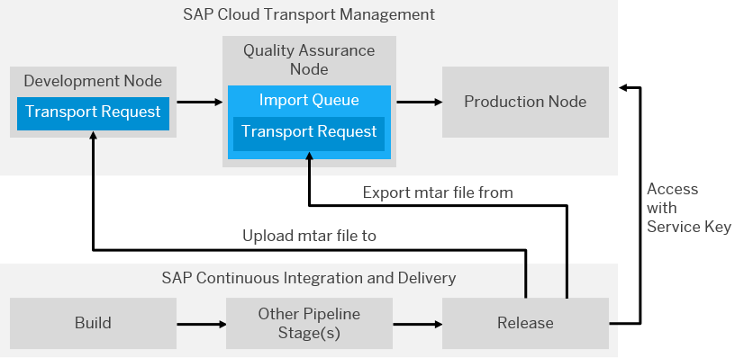
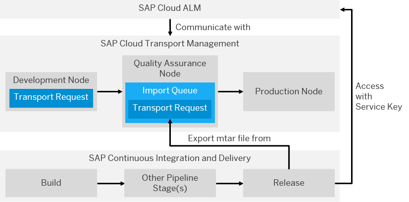

<!-- loioa0f029b80e054eb0afd0adb0900d4c19 -->

<link rel="stylesheet" type="text/css" href="css/sap-icons.css"/>

# Integrate Cloud Transport Management into Your Job

Implement a continuous delivery process by integrating the functionality of the SAP Cloud Transport Management service into your job.

<a name="loioa0f029b80e054eb0afd0adb0900d4c19__prereq_n4d_gnz_y1c"/>

## Prerequisites

-   You’ve either set up SAP Cloud Transport Management or SAP Cloud ALM. SAP Cloud ALM includes SAP Cloud Transport Management. See [Initial Setup of SAP Cloud Transport Management](https://help.sap.com/docs/cloud-transport-management/sap-cloud-transport-management/initial-setup) or [Required Setup for SAP Cloud ALM](https://help.sap.com/docs/cloud-alm/setup-administration/required-setup).

-   You’ve created a destination in the Cloud Foundry environment for each productive subaccount to which you want to transport an archive. See [Create Transport Destinations](https://help.sap.com/docs/cloud-transport-management/sap-cloud-transport-management/create-transport-destinations).

## Context

The SAP Cloud Transport Management service lets you define nodes and routes for a staged landscape with several spaces or subaccounts. Staged Landscapes are needed for a full-fledged continuous delivery process.

There are two ways to use the cloud transport management functionality together with SAP Continuous Integration and Delivery: You can either connect your job with SAP Cloud Transport Management itself or with SAP Cloud ALM, which includes the cloud transport management service.

Depending on which option you choose, expand one of the following sections for more information:

<a name="concept_hxf_qnz_y1c"/>

<!-- concept\_hxf\_qnz\_y1c -->

## Connect Your Job with SAP Cloud Transport Management

In the Release stage of your job, select your preferred transport operation and create a service key credential to connect to SAP Cloud Transport Management.

<a name="concept_hxf_qnz_y1c__section_i22_tnz_y1c"/>

## Transport Operation

If you connect the SAP Cloud Transport Management service with your job, you can choose between two different *Transport Operation* options: *Export from* and *Upload to*.

The following example graphic illustrates the difference between these two transport operations:

  
  
**Transport Operations with SAP Cloud Transport Management**

-   **Export from:**

    1.  In the Release stage of your job, SAP Continuous Integration and Delivery accesses SAP Cloud Transport Management through a Service Key credential. For more information, see the Service Key section.

    2.  The mtar file that has been created in the Build stage of your job is added to a transport request. This transport request can’t be changed anymore.

    3.  The transport request containing the mtar file is exported from the export node to the import queue of the following node. In the example graphic, it is exported from the development node to the import queue of the quality assurance node.

    If you choose *Export from* as transport operation, enter the name of the export node into the text field next to *Transport Operation* in SAP Continuous Integration and Delivery.

-   **Upload to:**

    1.  In the Release stage of your job, SAP Continuous Integration and Delivery accesses SAP Cloud Transport Management through a Service Key credential. For more information, see the Service Key section.

    2.  The mtar file that has been created in the Build stage of your job is added to a transport request within the upload node in SAP Cloud Transport Management. In the example graphic, it is added to a transport request within the development node.

    If you choose *Upload to* as transport operation, enter the name of the upload node into the text field next to *Transport Operation* in SAP Continuous Integration and Delivery

<a name="task_bhy_xrz_y1c"/>

<!-- task\_bhy\_xrz\_y1c -->

### Service Key

Create a Service Key credential to authenticate your job against SAP Cloud Transport Management.

<a name="task_bhy_xrz_y1c__steps_cgp_z25_blb"/>

## Procedure

1.  In the SAP BTP cockpit, navigate to the subaccount in which you’ve created an instance for SAP Cloud Transport Management.

2.  From the navigation area, choose  *Spaces* and select the space in which you’ve created the SAP Cloud Transport Management instance.

3.  From the navigation area, choose  *Services* \> *Instances*.

4.  Choose the name of your service instance.

5.  From the navigation area, choose :key: *Service Keys*.

6.  Copy the entire service key.

7.  In SAP Continuous Integration and Delivery, create a new Service Key credential and paste the copied service key into the respective text field. See [Creating Credentials](creating-credentials-6658c81.md).

<a name="concept_ztz_trz_y1c"/>

<!-- concept\_ztz\_trz\_y1c -->

## Connect Your Job with SAP Cloud ALM

In the Release stage of your job, select the transport operation and create a service key credential to connect to SAP Cloud Transport Management.

<a name="concept_ztz_trz_y1c__section_lrn_ztz_y1c"/>

## Transport Operation

If you connect SAP Cloud ALM with your job to access the SAP Cloud Transport Management functionality, choose*Export from* as *Transport Operation*.

The following example graphic illustrates the interplay between SAP Continuous Integration and Delivery, SAP Cloud ALM, and SAP Cloud Transport Management when using the *Export from* transport operation:

  
  
**Transport Operation with SAP Cloud ALM**

1.  In the Release stage of your job, SAP Continuous Integration and Delivery accesses SAP Cloud ALM through a Service Key credential. For more information, see the Service Key section.

2.  SAP Cloud ALM establishes the connection with SAP Cloud Transport Management.

3.  The mtar file that has been created in the Build stage of your job is added to a transport request. This transport request can’t be changed anymore.

    The transport request containing the mtar file is exported from the export node to the import queue of the following node. In the example graphic, it is exported from the development node to the import queue of the quality assurance node.

Enter the name of the export node into the text field next to Transport Operation in SAP Continuous Integration and Delivery.

<a name="task_y2d_kvz_y1c"/>

<!-- task\_y2d\_kvz\_y1c -->

### Service Key

Create a Service Key credential to authenticate your job against SAP Cloud ALM.

<a name="task_y2d_kvz_y1c__steps_z2d_kvz_y1c"/>

## Procedure

1.  In the SAP BTP cockpit, navigate to the subaccount in which you’ve created an instance for SAP Cloud ALM.

2.  From the navigation area, choose  *Spaces* and select the space in which you’ve created the SAP Cloud Transport Management instance.

3.  From the navigation area, choose  *Services* \> *Instances*.

4.  Choose the name of your service instance.

5.  From the navigation area, choose :key: *Service Keys*.

6.  Copy the entire service key.

7.  In SAP Continuous Integration and Delivery, create a new Service Key credential and paste the copied service key into the respective text field. See [Creating Credentials](creating-credentials-6658c81.md).

